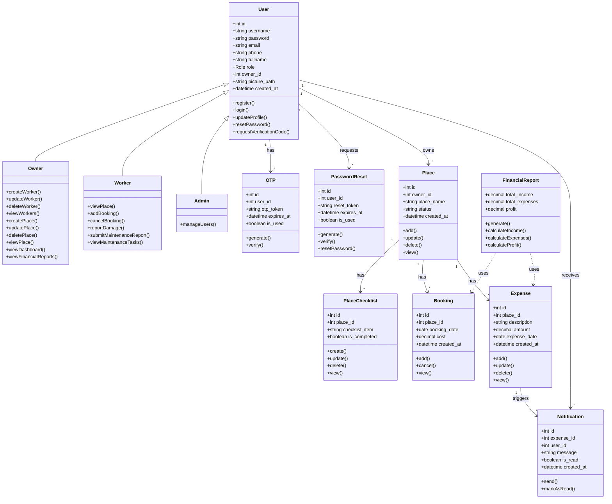

```mermaid
classDiagram

    class User {
        +int id
        +string username
        +string password
        +string email
        +string phone
        +string fullname
        +Role role
        +int owner_id
        +string picture_path
        +datetime created_at
        +register()
        +login()
        +updateProfile()
        +resetPassword()
        +requestVerificationCode()
    }

    class Owner {
        +createWorker()
        +updateWorker()
        +deleteWorker()
        +viewWorkers()
        +createPlace()
        +updatePlace()
        +deletePlace()
        +viewPlace()
        +viewDashboard()
        +viewFinancialReports()
    }

    class Worker {
        +viewPlace()
        +addBooking()
        +cancelBooking()
        +reportDamage()
        +submitMaintenanceReport()
        +viewMaintenanceTasks()
    }

    class Admin {
        +manageUsers()
    }

    class Place {
        +int id
        +int owner_id
        +string place_name
        +string status
        +datetime created_at
        +add()
        +update()
        +delete()
        +view()
    }

    class PlaceChecklist {
        +int id
        +int place_id
        +string checklist_item
        +boolean is_completed
        +create()
        +update()
        +delete()
        +view()
    }

    class Booking {
        +int id
        +int place_id
        +date booking_date
        +decimal cost
        +datetime created_at
        +add()
        +cancel()
        +view()
    }

    class Expense {
        +int id
        +int place_id
        +string description
        +decimal amount
        +date expense_date
        +datetime created_at
        +add()
        +update()
        +delete()
        +view()
    }

    class OTP {
        +int id
        +int user_id
        +string otp_token
        +datetime expires_at
        +boolean is_used
        +generate()
        +verify()
    }

    class PasswordReset {
        +int id
        +int user_id
        +string reset_token
        +datetime expires_at
        +boolean is_used
        +generate()
        +verify()
        +resetPassword()
    }

    class Notification {
        +int id
        +int expense_id
        +int user_id
        +string message
        +boolean is_read
        +datetime created_at
        +send()
        +markAsRead()
    }

    class FinancialReport {
        +decimal total_income
        +decimal total_expenses
        +decimal profit
        +generate()
        +calculateIncome()
        +calculateExpenses()
        +calculateProfit()
    }


    User <|-- Owner
    User <|-- Worker
    User <|-- Admin

    User "1" --> "*" OTP : has
    User "1" --> "*" PasswordReset : requests
    User "1" --> "*" Place : owns
    User "1" --> "*" Notification : receives

    Place "1" --> "*" PlaceChecklist : has
    Place "1" --> "*" Booking : has
    Place "1" --> "*" Expense : has

    Expense "1" --> "*" Notification : triggers

    FinancialReport ..> Booking : uses
    FinancialReport ..> Expense : uses
```