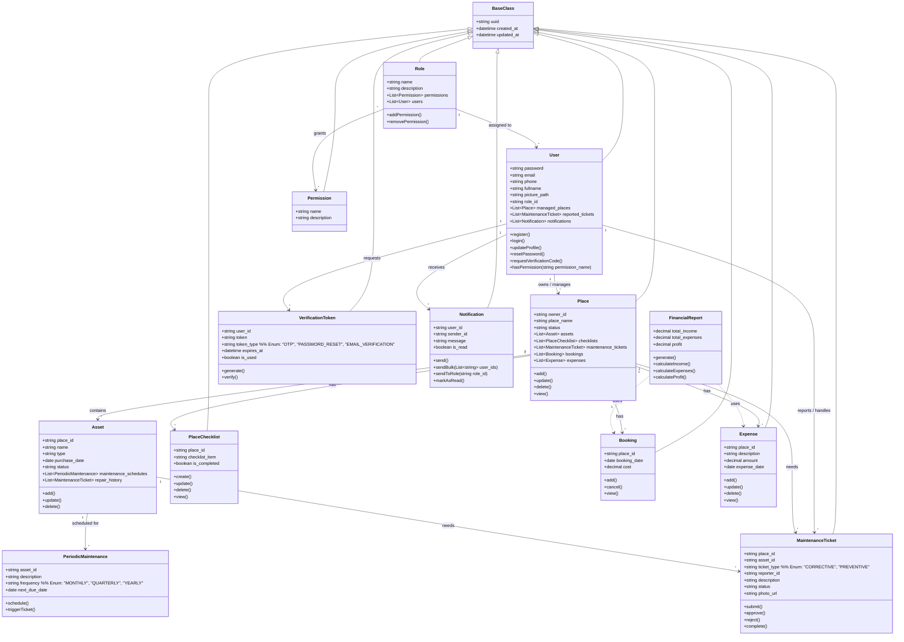

```mermaid
classDiagram

    class BaseClass {
        +string uuid
        +datetime created_at
        +datetime updated_at
    }

    class User {
        +string password
        +string email
        +string phone
        +string fullname
        +string picture_path
        +string role_id
        
        +List~Place~ managed_places
        +List~MaintenanceTicket~ reported_tickets
        +List~Notification~ notifications
        
        +register()
        +login()
        +updateProfile()
        +resetPassword()
        +requestVerificationCode()
        +hasPermission(string permission_name)
    }

    class Role {
        +string name
        +string description

        +List~Permission~ permissions
        +List~User~ users
        
        +addPermission()
        +removePermission()
    }

    class Permission {
        +string name
        +string description
    }

    class Place {
        +string owner_id
        +string place_name
        +string status
        
        +List~Asset~ assets
        +List~PlaceChecklist~ checklists
        +List~MaintenanceTicket~ maintenance_tickets
        +List~Booking~ bookings
        +List~Expense~ expenses
        
        +add()
        +update()
        +delete()
        +view()
    }

    class Asset {
        +string place_id
        +string name
        +string type
        +date purchase_date
        +string status
        
        +List~PeriodicMaintenance~ maintenance_schedules
        +List~MaintenanceTicket~ repair_history
        
        +add()
        +update()
        +delete()
    }

    class PeriodicMaintenance {
        +string asset_id
        +string description
        +string frequency %% Enum: "MONTHLY", "QUARTERLY", "YEARLY"
        +date next_due_date
        
        +schedule()
        +triggerTicket()
    }

    class MaintenanceTicket {
        +string place_id
        +string asset_id
        +string ticket_type %% Enum: "CORRECTIVE", "PREVENTIVE"
        +string reporter_id
        +string description
        +string status
        +string photo_url
        +submit()
        +approve()
        +reject()
        +complete()
    }

    class PlaceChecklist {
        +string place_id
        +string checklist_item
        +boolean is_completed
        +create()
        +update()
        +delete()
        +view()
    }

    class Booking {
        +string place_id
        +date booking_date
        +decimal cost
        +add()
        +cancel()
        +view()
    }

    class Expense {
        +string place_id
        +string description
        +decimal amount
        +date expense_date
        +add()
        +update()
        +delete()
        +view()
    }

    class VerificationToken {
        +string user_id
        +string token
        +string token_type  %% Enum: "OTP", "PASSWORD_RESET", "EMAIL_VERIFICATION"
        +datetime expires_at
        +boolean is_used
        +generate()
        +verify()
    }

    class Notification {
        +string user_id
        +string sender_id
        +string message
        +boolean is_read
        +send()
        +sendBulk(List~string~ user_ids)
        +sendToRole(string role_id)
        +markAsRead()
    }

    class FinancialReport {
        +decimal total_income
        +decimal total_expenses
        +decimal profit
        +generate()
        +calculateIncome()
        +calculateExpenses()
        +calculateProfit()
    }

    %% Inheritance from BaseClass
    BaseClass <|-- User
    BaseClass <|-- Role
    BaseClass <|-- Permission
    BaseClass <|-- Place
    BaseClass <|-- MaintenanceTicket
    BaseClass <|-- PlaceChecklist
    BaseClass <|-- Booking
    BaseClass <|-- Expense
    BaseClass <|-- Notification
    BaseClass <|-- VerificationToken

    %% RBAC Relationships (Roles & Permissions)
    Role "1" --> "*" User : assigned to
    Role "*" --> "*" Permission : grants

    %% User Relationships
    User "1" --> "*" Place : owns / manages
    User "1" --> "*" VerificationToken : requests
    User "1" --> "*" Notification : receives
    User "1" --> "*" MaintenanceTicket : reports / handles

    %% Place Relationships
    Place "1" --> "*" PlaceChecklist : has
    Place "1" --> "*" Booking : has
    Place "1" --> "*" Expense : has
    Place "1" --> "*" MaintenanceTicket : needs
    Place "1" --> "*" Asset : contains

    %% Functional Dependencies
    FinancialReport ..> Booking : uses
    FinancialReport ..> Expense : uses

    Asset "1" --> "*" PeriodicMaintenance : scheduled for
    Asset "1" --> "*" MaintenanceTicket : needs
```
