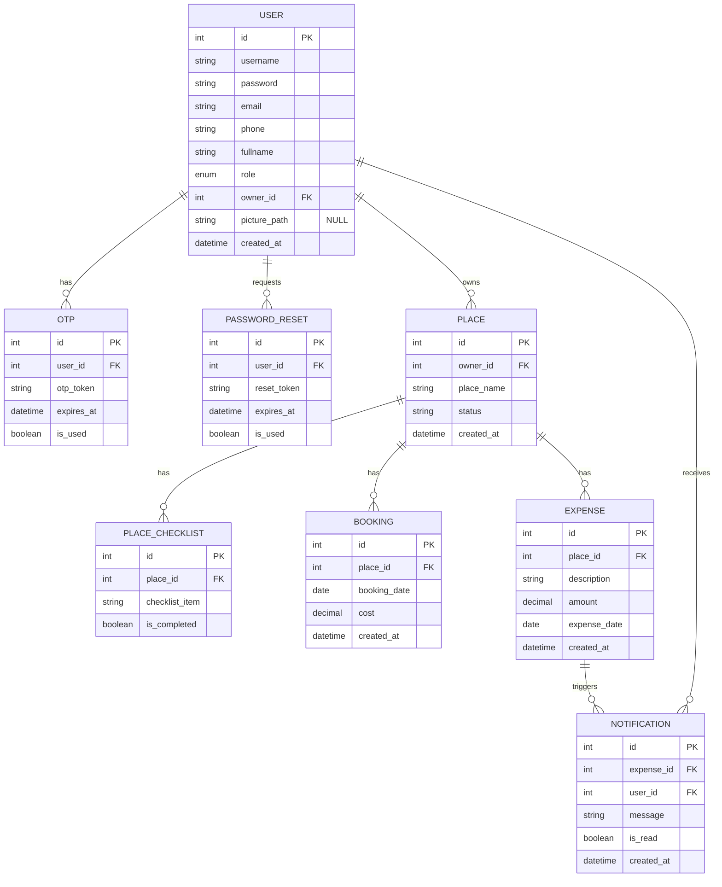

```mermaid
erDiagram

    USER {
        int id PK
        string username
        string password
        string email
        string phone
        string fullname
        enum role
        int owner_id FK
        string picture_path "NULL"
        datetime created_at
    }

    OTP {
        int id PK
        int user_id FK
        string otp_token
        datetime expires_at
        boolean is_used
    }

    PASSWORD_RESET {
        int id PK
        int user_id FK
        string reset_token
        datetime expires_at
        boolean is_used
    }

    PLACE {
        int id PK
        int owner_id FK
        string place_name
        string status
        datetime created_at
    }

    PLACE_CHECKLIST {
        int id PK
        int place_id FK
        string checklist_item
        boolean is_completed
    }

    BOOKING {
        int id PK
        int place_id FK
        date booking_date
        decimal cost
        datetime created_at
    }

    EXPENSE {
        int id PK
        int place_id FK
        string description
        decimal amount
        date expense_date
        datetime created_at
    }

    NOTIFICATION {
        int id PK
        int expense_id FK
        int user_id FK
        string message
        boolean is_read
        datetime created_at
    }

    USER ||--o{ OTP : has
    USER ||--o{ PASSWORD_RESET : requests
    USER ||--o{ PLACE : owns
    PLACE ||--o{ PLACE_CHECKLIST : has
    PLACE ||--o{ BOOKING : has
    PLACE ||--o{ EXPENSE : has
    EXPENSE ||--o{ NOTIFICATION : triggers
    USER ||--o{ NOTIFICATION : receives
```