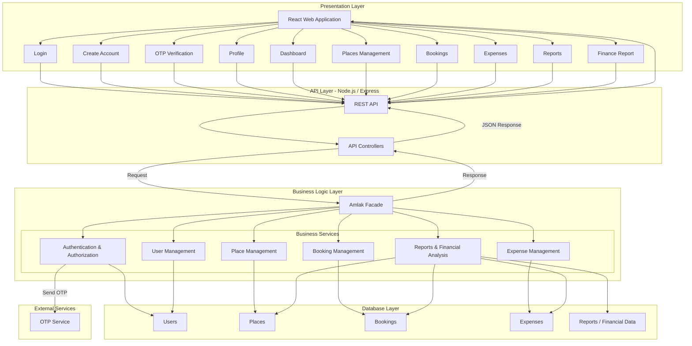

```mermaid
flowchart TD

    %% ========================================
    %% PRESENTATION LAYER
    %% ========================================

    subgraph Presentation["Presentation Layer"]

        React["React Web Application"]

        Login["Login"]
        Register["Create Account"]
        OTP["OTP Verification"]
        Profile["Profile"]
        Dashboard["Dashboard"]
        Places["Places Management"]
        Bookings["Bookings"]
        Expenses["Expenses"]
        Reports["Reports"]
        Finance["Finance Report"]

        React --> Login
        React --> Register
        React --> OTP
        React --> Profile
        React --> Dashboard
        React --> Places
        React --> Bookings
        React --> Expenses
        React --> Reports
        React --> Finance

    end


    %% ========================================
    %% API LAYER
    %% ========================================

    subgraph API["API Layer - Node.js / Express"]

        REST["REST API"]
        Controllers["API Controllers"]

        REST --> Controllers

    end


    %% ========================================
    %% BUSINESS LOGIC LAYER
    %% ========================================

    subgraph Logic["Business Logic Layer"]

        Facade["Amlak Facade"]

        subgraph Services["Business Services"]

            Auth["Authentication & Authorization"]
            UserManagement["User Management"]
            PlaceManagement["Place Management"]
            BookingManagement["Booking Management"]
            ExpenseManagement["Expense Management"]
            ReportService["Reports & Financial Analysis"]

        end

        Facade --> Auth
        Facade --> UserManagement
        Facade --> PlaceManagement
        Facade --> BookingManagement
        Facade --> ExpenseManagement
        Facade --> ReportService

    end


    %% ========================================
    %% DATABASE LAYER
    %% ========================================

    subgraph Database["Database Layer"]

        UsersDB["Users"]
        PlacesDB["Places"]
        BookingsDB["Bookings"]
        ExpensesDB["Expenses"]
        ReportsDB["Reports / Financial Data"]

    end


    %% ========================================
    %% EXTERNAL SERVICES
    %% ========================================

    subgraph External["External Services"]

        OTPService["OTP Service"]

    end


    %% ========================================
    %% PRESENTATION / USER ACCESS
    %% ========================================

    Login --> REST
    Register --> REST
    OTP --> REST
    Profile --> REST
    Dashboard --> REST
    Places --> REST
    Bookings --> REST
    Expenses --> REST
    Reports --> REST
    Finance --> REST


    %% ========================================
    %% API -> BUSINESS LOGIC
    %% ========================================

    Controllers -->|"Request"| Facade


    %% ========================================
    %% BUSINESS LOGIC -> DATABASE
    %% ========================================

    Auth --> UsersDB

    UserManagement --> UsersDB

    PlaceManagement --> PlacesDB

    BookingManagement --> BookingsDB

    ExpenseManagement --> ExpensesDB

    ReportService --> ReportsDB

    ReportService --> BookingsDB
    ReportService --> ExpensesDB
    ReportService --> PlacesDB


    %% ========================================
    %% OTP EXTERNAL SERVICE
    %% ========================================

    Auth -->|"Send OTP"| OTPService


    %% ========================================
    %% RESPONSE FLOW
    %% ========================================

    Facade -->|"Response"| Controllers

    Controllers -->|"JSON Response"| REST

    REST --> React    
```