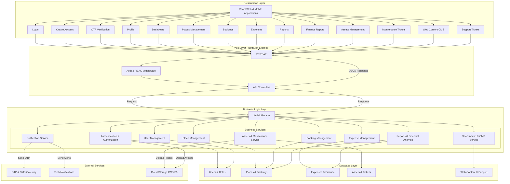
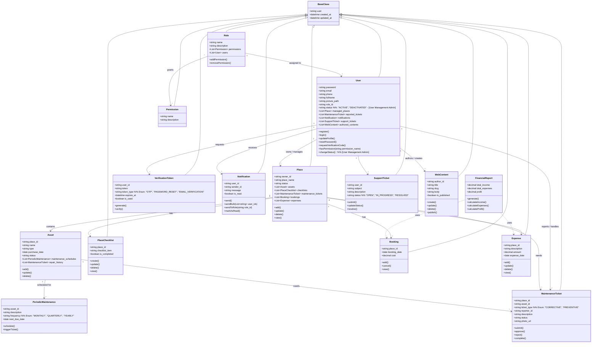
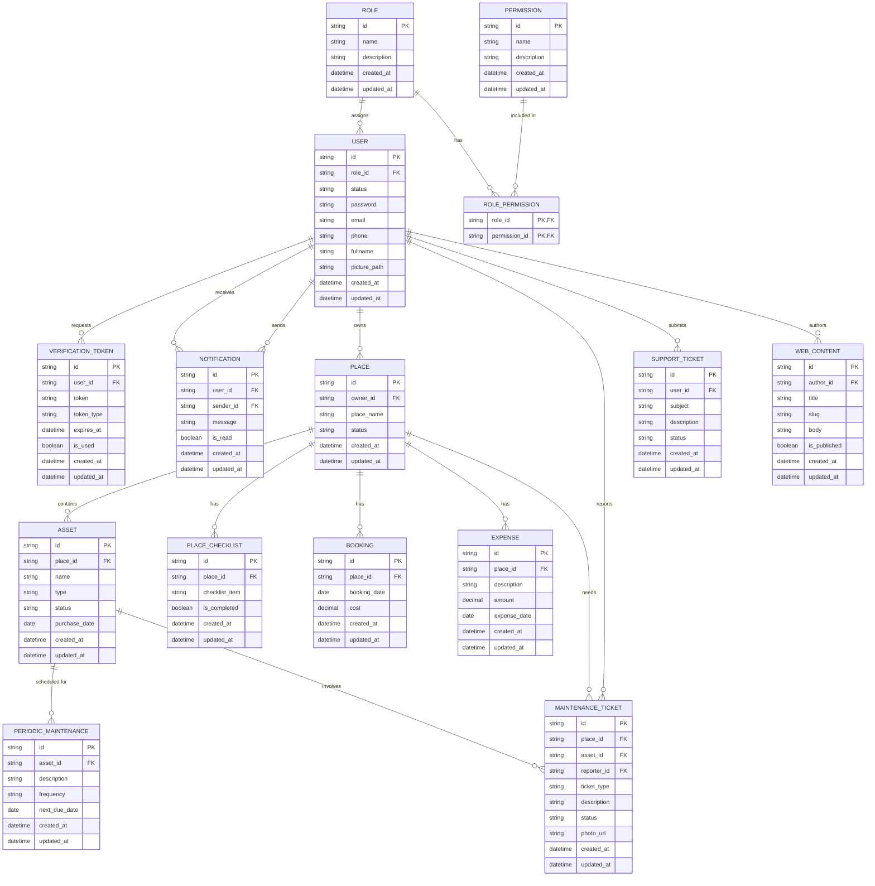

# System Requirements Specification
## 1. System Roles Explained

The system caters to different user types, each with specific permissions and responsibilities to ensure smooth property and maintenance management.

* **Admin:** The highest level of authority in the system. Admins represent the platform owners.

* **Manager:** The primary decision-maker and supervisor for properties. Managers handle high-level operations including property/asset management (CRUD), financial tracking, scheduling maintenance, and reviewing reports and tickets.

* **Worker:** The on-the-ground operational staff. Workers are responsible for day-to-day tasks such as executing property checklists, logging bookings, reporting damaged assets, and submitting visual proof of completed maintenance.

* **User:** A general or unassigned account type (often the starting point before being assigned a Manager or Worker role, or acting as a client/tenant). They interact with basic account settings, onboarding, and profile setup.

## 2. Prioritized User Stories

*Priority Levels: **Must Have** (Critical for launch), **Should Have** (Important but not a showstopper), **Nice to Have** (Enhancement for future iterations).*

| Category | Role | User Story | Priority |
| :--- | :--- | :--- | :--- |
| **Authentication** | User | As a user, I want to register an account using my full name, email, and password so that I can securely save my data. | Must Have |
| **Authentication** | User | As a user, I want to log in using my credentials so that I can securely access my account and resume my activities. | Must Have |
| **Authentication** | Admin | As an admin, I want the system to send an OTP via email so that user identities can be securely verified. | Must Have |
| **Authentication** | User | As a user, I want to manage my basic information (e.g., profile picture, name) so that my account profile remains accurate and complete. | Must Have |
| **Authentication** | User | As a user, I want to sign up via Single Sign-On (Google/Apple) so that I can access the system quickly without creating a new password. | Nice to Have |
| **Authentication** | User | As a user, I want to request a new verification code so that I can complete registration if the initial code is delayed or lost. | Must Have |
| **Authentication** | User | As a user, I want to select my interests during onboarding so that the system can personalize my content. | Nice to Have |
| **Onboarding** | Manager/Worker | As a manager/worker, I want clear explanations for device permission requests (Location/Camera) so that I understand why the app needs them. | Must Have |
| **Onboarding** | User | As a user, I want the option to skip the onboarding tutorial so that I can access the application immediately. | Nice to Have |
| **Onboarding** | User | As a user, I want a brief introductory walkthrough so that I can quickly understand the application's core features and value. | Nice to Have |
| **Onboarding** | Manager/Worker | As a manager/worker, I want contextual tooltips during my first login so that I can easily navigate and discover key features. | Nice to Have |
| **Property & Asset** | Manager | As a manager, I want to add, edit, and delete properties so that I can accurately track their maintenance and financial data. | Must Have |
| **Property & Asset** | Worker | As a worker, I want to report damaged assets or required maintenance so that the property remains in optimal condition. | Must Have |
| **Property & Asset** | Manager | As a manager, I want a unified dashboard showing property and asset health so that I can monitor the status of all locations at a glance. | Must Have |
| **Maintenance** | Manager | As a manager, I want to create customized pre- and post-booking checklists so that workers can ensure quality standards are met. | Must Have |
| **Maintenance** | Manager | As a manager, I want to receive and review maintenance tickets so that I can approve or reject them based on priority and budget. | Must Have |
| **Maintenance** | Worker | As a worker, I want to submit maintenance reports with photo attachments so that I can provide visual proof of completed work or damages. | Must Have |
| **Maintenance** | Manager | As a manager, I want to schedule periodic asset maintenance so that properties remain safe, functional, and in good condition. | Must Have |
| **Maintenance** | Worker | As a worker, I want to receive email reminders for upcoming maintenance tasks so that I do not miss any scheduled work. | Must Have |
| **Maintenance** | Manager | As a manager, I want to receive automated email alerts for overdue or incomplete maintenance tasks so that I can address operational delays promptly. | Must Have |
| **Booking** | Worker | As a worker, I want to manage (add/cancel) bookings on a calendar, including guest info and pricing, so that I can maintain an accurate reservation schedule. | Must Have |
| **Financial** | Manager | As a manager, I want to log all property expenses (maintenance, bills, taxes) so that I can maintain accurate financial records. | Must Have |
| **Financial** | Manager | As a manager, I want to generate financial reports so that I can effectively track profit, loss, and overall financial health. | Must Have | 
| **Financial** | Admin | As an Admin I want to manage plans and payments so I can edit account limits and refund users. | Should Have | 
| **Content management** | Admin | As an Admin I want to create, edit and delete web content so that information stay up to date. | Must Have |
| **User management**| Admin | As an Admin I want to view, edit and deactivate user accounts so that I can control their access. | Must Have | 
| support| Admin | As an Admin I want to view user support requests so that I can resolve problems. | Must Have | 
| **Notification** | Admin | As an Admin I want to send notifications to users so I can communicate updates. | Must Have | 
| **Reporting & Analytics** | Admin | As an Admin I want to view statistics and filter data so I can export information. | Should Have | 

## 3. Non-Functional Requirements (NFRs)

To ensure the system is secure, reliable, and scalable, the following technical requirements must be met:

### Security & Authentication

* **JWT (JSON Web Tokens):** All API communications between the client (web app) and the server must be secured using JWT for stateless user authentication and session management.

* **RBAC (Role-Based Access Control):** The system must enforce strict route and data protection based on the assigned roles (Admin, Manager, Worker, User). A Worker should never be able to access Manager financial reports.

* **Data Encryption:** Sensitive data (passwords, financial records) must be encrypted at rest in the database, and all data in transit must be secured using HTTPS/TLS.

### Performance & Scalability

* **Response Time:** API endpoints, especially those dealing with dashboard metrics and booking calendars, should respond within 500ms under normal load.

* **Media Optimization:** Uploaded images for maintenance reports or profile pictures must be compressed before being stored in cloud storage (e.g., AWS S3) to preserve bandwidth and storage.

### Usability & Accessibility

* **Mobile-First / Responsive Design:** Since workers will be operating on-site logging photos and checklists, the worker interface must be heavily optimized for mobile devices.

* **Cross-Platform Consistency:** The application UI should behave consistently across iOS, Android, and web platforms.

### Reliability & Integrations

* **Notification Gateways:** The system must reliably integrate with third-party email providers (e.g., SendGrid, AWS SES) and SMS gateways (e.g., Twilio) to ensure OTPs and maintenance reminders are delivered promptly.

* **Audit Logging:** Critical actions, such as approving maintenance tickets, recording expenses, or deleting a property, must be logged with a timestamp and the user ID for auditing purposes.

## 4 Figma design guide

https://www.figma.com/design/E2nABXzciiIHZAPG5mNXVM/Abdulwahab-Almatrudi-s-team-library?node-id=3342-3806&t=WxAnupDwu3UPe9A0-1

## 5 high-level architecture diagram

## 6 Class-diagram

## 7 ER-diagram

