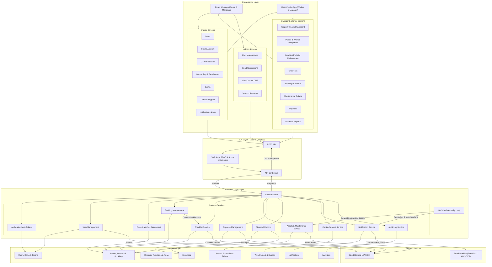
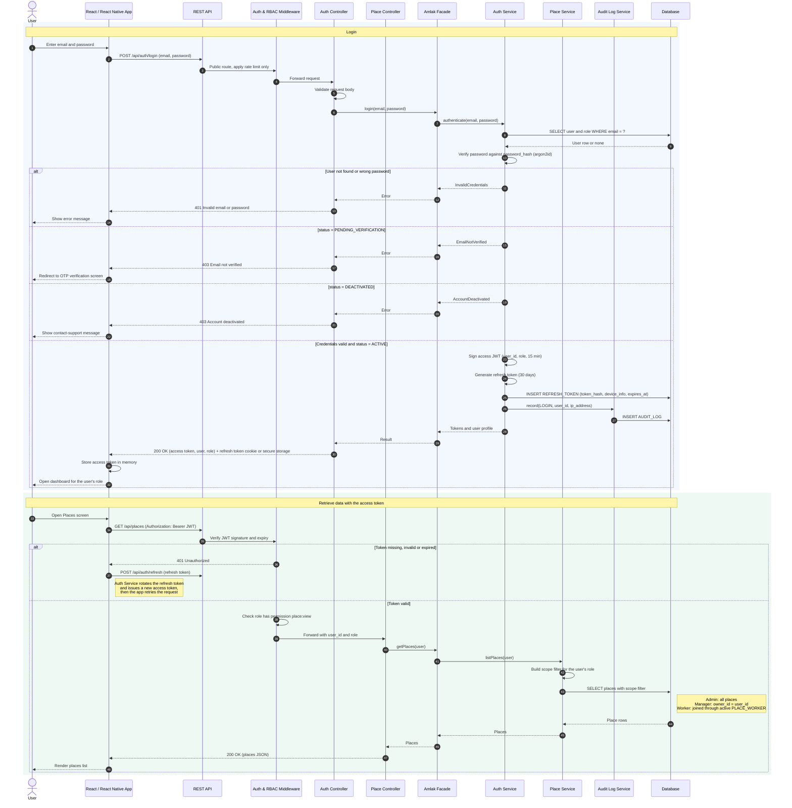
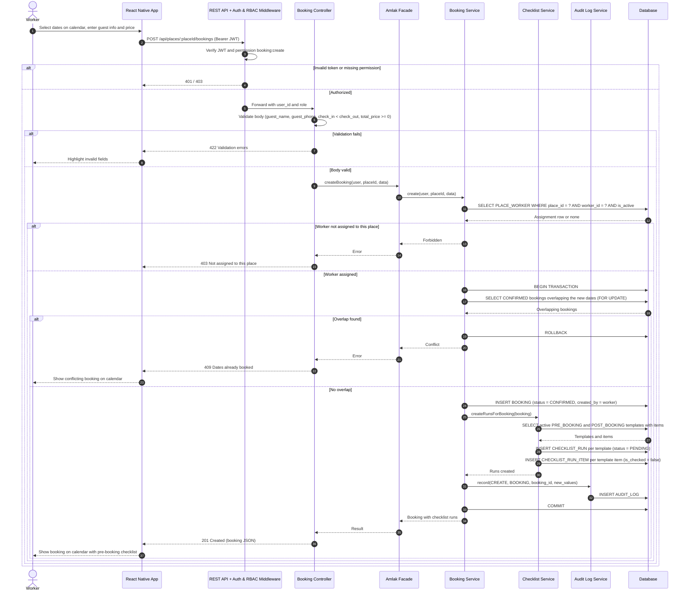
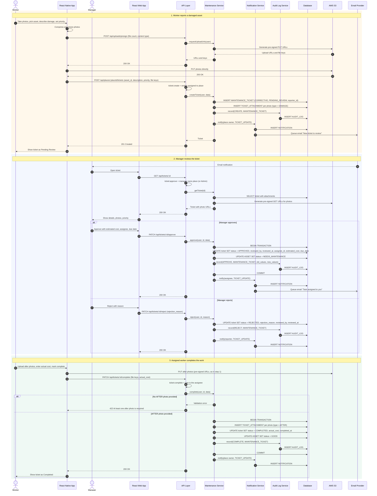
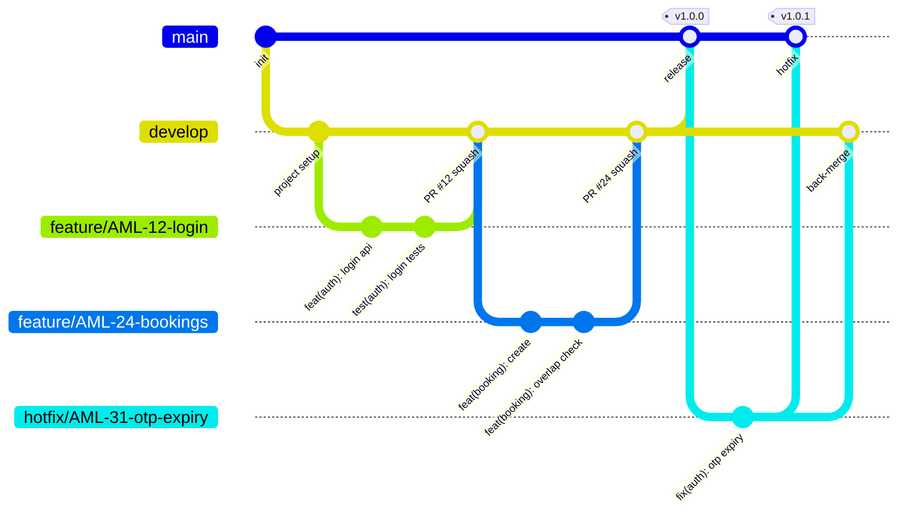
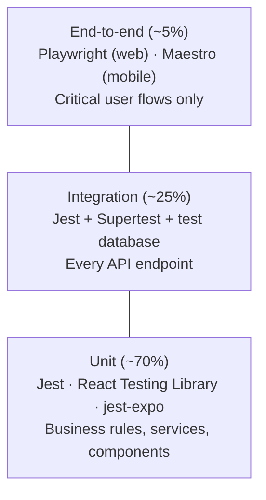

# Amlak — System Requirements Specification

## 1. System Roles Explained

* **Admin:** The highest level of authority. Admins represent the platform owners and have full control over everything in the system: user accounts, web content, support requests and notifications, and also every manager's places, workers, assets, checklists, bookings, tickets, expenses and financial reports.

* **Manager:** The owner/supervisor of properties. Managers handle property and asset CRUD, assign workers to their properties, build checklists, review maintenance tickets, schedule periodic maintenance, log expenses and generate financial reports.

* **Worker:** On-site operational staff, always assigned to one or more properties by a Manager. Workers run checklists, manage bookings, report damaged assets and submit photo proof. A Worker can only see data for places they are assigned to, and never sees financial data.

* **User:** A newly registered or unassigned account. Has access to account settings, onboarding and profile only, until an Admin changes their role.

---

## 2. Prioritized User Stories

*Priority Levels: **Must Have** (critical for launch, implemented in this version), **Should Have** (important, future development), **Nice to Have** (enhancement for future iterations).*

| Category | Role | User Story | Priority |
| :--- | :--- | :--- | :--- |
| **Authentication** | User | As a user, I want to register an account using my full name, email, and password so that I can securely save my data. | Must Have |
| **Authentication** | User | As a user, I want to log in using my credentials so that I can securely access my account and resume my activities. | Must Have |
| **Authentication** | Admin | As an admin, I want the system to send an OTP via email so that user identities can be securely verified. | Must Have |
| **Authentication** | User | As a user, I want to manage my basic information (e.g., profile picture, name) so that my account profile remains accurate and complete. | Must Have |
| **Authentication** | User | As a user, I want to request a new verification code so that I can complete registration if the initial code is delayed or lost. | Must Have |
| **Authentication** | User | As a user, I want to sign up via Single Sign-On (Google/Apple) so that I can access the system quickly without creating a new password. | Nice to Have |
| **Authentication** | User | As a user, I want to select my interests during onboarding so that the system can personalize my content. | Nice to Have |
| **Onboarding** | Manager/Worker | As a manager/worker, I want clear explanations for device permission requests (Location/Camera) so that I understand why the app needs them. | Must Have |
| **Onboarding** | User | As a user, I want the option to skip the onboarding tutorial so that I can access the application immediately. | Nice to Have |
| **Onboarding** | User | As a user, I want a brief introductory walkthrough so that I can quickly understand the application's core features and value. | Nice to Have |
| **Onboarding** | Manager/Worker | As a manager/worker, I want contextual tooltips during my first login so that I can easily navigate and discover key features. | Nice to Have |
| **Property & Asset** | Manager | As a manager, I want to add, edit, and delete properties so that I can accurately track their maintenance and financial data. | Must Have |
| **Property & Asset** | Manager | *(new)* As a manager, I want to assign and unassign workers to my properties so that each worker only sees and operates on the places they are responsible for. | Must Have |
| **Property & Asset** | Worker | As a worker, I want to report damaged assets or required maintenance so that the property remains in optimal condition. | Must Have |
| **Property & Asset** | Manager | As a manager, I want a unified dashboard showing property and asset health so that I can monitor the status of all locations at a glance. | Must Have |
| **Maintenance** | Manager | As a manager, I want to create customized pre- and post-booking checklists so that workers can ensure quality standards are met. | Must Have |
| **Maintenance** | Manager | As a manager, I want to receive and review maintenance tickets so that I can approve or reject them based on priority and budget. | Must Have |
| **Maintenance** | Worker | As a worker, I want to submit maintenance reports with photo attachments so that I can provide visual proof of completed work or damages. | Must Have |
| **Maintenance** | Manager | As a manager, I want to schedule periodic asset maintenance so that properties remain safe, functional, and in good condition. | Must Have |
| **Maintenance** | Worker | As a worker, I want to receive email reminders for upcoming maintenance tasks so that I do not miss any scheduled work. | Must Have |
| **Maintenance** | Manager | As a manager, I want to receive automated email alerts for overdue or incomplete maintenance tasks so that I can address operational delays promptly. | Must Have |
| **Booking** | Worker | As a worker, I want to manage (add/cancel) bookings on a calendar, including guest info and pricing, so that I can maintain an accurate reservation schedule. | Must Have |
| **Financial** | Manager | As a manager, I want to log all property expenses (maintenance, bills, taxes) so that I can maintain accurate financial records. | Must Have |
| **Financial** | Manager | As a manager, I want to generate financial reports so that I can effectively track profit, loss, and overall financial health. | Must Have |
| **Financial** | Admin | As an Admin I want to manage plans and payments so I can edit account limits and refund users. | Should Have |
| **Content Management** | Admin | As an Admin I want to create, edit and delete web content so that information stays up to date. | Must Have |
| **User Management** | Admin | As an Admin I want to view, edit and deactivate user accounts so that I can control their access. | Must Have |
| **Support** | Admin | As an Admin I want to view user support requests so that I can resolve problems. | Must Have |
| **Notification** | Admin | As an Admin I want to send notifications to users so I can communicate updates. | Must Have |
| **Reporting & Analytics** | Admin | As an Admin I want to view statistics and filter data so I can export information. | Should Have |

---

## 3. Key Business Rules

### 3.1 Data scoping
* A **Manager** sees only places where `place.owner_id = manager.id`, and everything under them (assets, bookings, tickets, expenses, checklists, assigned workers).
* A **Worker** sees only places listed in `PLACE_WORKER` for that worker (with `is_active = true`), and only operational data under them. Expenses and financial reports are never returned to a Worker.
* An **Admin** is not scoped: they can view, create, edit and delete any record in the system, across all managers and places. When an Admin creates a place, they must choose the Manager who owns it (`owner_id`). Every Admin change to business data is written to `AUDIT_LOG` like any other critical action.

### 3.2 Bookings
* A booking covers `check_in_date` to `check_out_date`. Two `CONFIRMED` bookings on the same place cannot overlap.
* Cancelling sets `status = CANCELLED`, `cancelled_at`, `cancelled_by` and `cancellation_reason`. Bookings are never hard-deleted.
* Creating a booking creates a `PRE_BOOKING` checklist run and a `POST_BOOKING` checklist run from the place's active templates.

### 3.3 Checklists
* A **template** belongs to a place and has a type (`PRE_BOOKING` or `POST_BOOKING`) and ordered items. Items can require a photo.
* A **run** is one execution of a template for one booking, by one worker. Run items record whether each item was checked, plus an optional note and photo.
* Editing a template never changes past runs.

### 3.4 Maintenance ticket lifecycle

```
PENDING_REVIEW ──approve──> APPROVED ──start──> IN_PROGRESS ──complete──> COMPLETED
       │
       └──reject──> REJECTED   (rejection_reason required)
```

* `CORRECTIVE` tickets are opened by a Worker (damage report). `PREVENTIVE` tickets are generated by the scheduler from `PERIODIC_MAINTENANCE`.
* Preventive tickets are created already `APPROVED`, with `assignee_id` taken from the schedule's `default_assignee_id`.
* A ticket is **overdue** when `due_date < today` and status is `APPROVED` or `IN_PROGRESS`. Overdue is computed, not stored.
* Completing a ticket requires at least one `AFTER` photo attachment.
* When a ticket is approved, the asset status becomes `NEEDS_MAINTENANCE`. When it is completed, the asset returns to `GOOD` unless the manager sets otherwise.

### 3.5 Scheduler jobs (daily)
| Job | Rule | Recipient |
| :--- | :--- | :--- |
| Generate preventive tickets | For each active schedule with `next_due_date - lead_days <= today`, create a ticket and advance `next_due_date` by the frequency | — |
| Upcoming reminder | Ticket due within 2 days and `reminder_sent_at` is null | Assignee (Worker), email + in-app |
| Overdue alert | Ticket is overdue and `overdue_alert_sent_at` is null | Place owner (Manager), email + in-app |

### 3.6 Financial reports
* **Income** = sum of `total_price` for `CONFIRMED` bookings whose `check_in_date` falls in the period.
* **Expenses** = sum of `amount` for expenses whose `expense_date` falls in the period.
* **Profit** = income − expenses.
* Reports can be filtered by period and by place, and broken down by expense category. They are computed on request, not stored.

### 3.7 Enumerations
| Field | Values |
| :--- | :--- |
| `USER.status` | `PENDING_VERIFICATION`, `ACTIVE`, `DEACTIVATED` |
| `ROLE.name` | `ADMIN`, `MANAGER`, `WORKER`, `USER` |
| `PLACE.status` | `ACTIVE`, `INACTIVE`, `UNDER_MAINTENANCE` |
| `PLACE.place_type` | `APARTMENT`, `VILLA`, `CHALET`, `ROOM`, `OTHER` |
| `ASSET.status` | `GOOD`, `NEEDS_MAINTENANCE`, `UNDER_MAINTENANCE`, `OUT_OF_SERVICE` |
| `BOOKING.status` | `CONFIRMED`, `CANCELLED` |
| `CHECKLIST_TEMPLATE.checklist_type` | `PRE_BOOKING`, `POST_BOOKING` |
| `CHECKLIST_RUN.status` | `PENDING`, `IN_PROGRESS`, `COMPLETED` |
| `MAINTENANCE_TICKET.ticket_type` | `CORRECTIVE`, `PREVENTIVE` |
| `MAINTENANCE_TICKET.priority` | `LOW`, `MEDIUM`, `HIGH`, `URGENT` |
| `MAINTENANCE_TICKET.status` | `PENDING_REVIEW`, `APPROVED`, `REJECTED`, `IN_PROGRESS`, `COMPLETED` |
| `TICKET_ATTACHMENT.attachment_type` | `DAMAGE`, `BEFORE`, `AFTER` |
| `PERIODIC_MAINTENANCE.frequency` | `MONTHLY`, `QUARTERLY`, `YEARLY` |
| `EXPENSE.category` | `MAINTENANCE`, `UTILITIES`, `TAXES`, `CLEANING`, `SUPPLIES`, `OTHER` |
| `VERIFICATION_TOKEN.token_type` | `EMAIL_OTP`, `PASSWORD_RESET` |
| `NOTIFICATION.type` | `ANNOUNCEMENT`, `MAINTENANCE_REMINDER`, `OVERDUE_ALERT`, `TICKET_UPDATE`, `SYSTEM` |
| `SUPPORT_TICKET.status` | `OPEN`, `IN_PROGRESS`, `RESOLVED` |
| `AUDIT_LOG.action` | `CREATE`, `UPDATE`, `DELETE`, `APPROVE`, `REJECT`, `COMPLETE`, `CANCEL`, `DEACTIVATE`, `LOGIN` |

---

## 4. RBAC Permission Matrix

✅ = allowed · 🔸 = only within own/assigned places · ❌ = denied

| Permission | Admin | Manager | Worker | User |
| :--- | :---: | :---: | :---: | :---: |
| `profile:manage_own` | ✅ | ✅ | ✅ | ✅ |
| `place:create / update / delete` | ✅ | 🔸 | ❌ | ❌ |
| `place:view` | ✅ | 🔸 | 🔸 | ❌ |
| `place_worker:assign` | ✅ | 🔸 | ❌ | ❌ |
| `asset:create / update / delete` | ✅ | 🔸 | ❌ | ❌ |
| `asset:view` | ✅ | 🔸 | 🔸 | ❌ |
| `dashboard:view` | ✅ | 🔸 | ❌ | ❌ |
| `checklist_template:manage` | ✅ | 🔸 | ❌ | ❌ |
| `checklist_run:execute` | ✅ | 🔸 | 🔸 | ❌ |
| `booking:create / cancel / view` | ✅ | 🔸 | 🔸 | ❌ |
| `ticket:create` (damage report) | ✅ | 🔸 | 🔸 | ❌ |
| `ticket:approve / reject` | ✅ | 🔸 | ❌ | ❌ |
| `ticket:complete` (with photos) | ✅ | 🔸 | 🔸 (assignee only) | ❌ |
| `periodic_maintenance:manage` | ✅ | 🔸 | ❌ | ❌ |
| `expense:manage` | ✅ | 🔸 | ❌ | ❌ |
| `financial_report:view` | ✅ | 🔸 | ❌ | ❌ |
| `user:view / update / deactivate` | ✅ | ❌ | ❌ | ❌ |
| `web_content:manage` | ✅ | ❌ | ❌ | ❌ |
| `support_ticket:create` | ✅ | ✅ | ✅ | ✅ |
| `support_ticket:view_all / resolve` | ✅ | ❌ | ❌ | ❌ |
| `notification:send` | ✅ | ❌ | ❌ | ❌ |
| `audit_log:view` | ✅ | 🔸 | ❌ | ❌ |

The 🔸 checks are enforced in the service layer (ownership / assignment lookup), not only by role in the middleware. Admin requests skip the ownership / assignment lookup and can act on any place.

---

## 5. Non-Functional Requirements (NFRs)

### Security & Authentication

* **JWT with refresh tokens:** Access tokens are short-lived (15 minutes) and carry `user_id` and `role`. Refresh tokens are long-lived (30 days), stored **hashed** in `REFRESH_TOKEN`, rotated on every use and revoked on logout or account deactivation. Web clients keep the refresh token in an `HttpOnly`, `Secure`, `SameSite=Strict` cookie. Mobile clients keep it in secure storage (Keychain / Keystore).

* **RBAC:** Every route is protected by role-based middleware (Section 4), and every query that touches place data is additionally scoped by ownership (Manager) or assignment (Worker). A Worker must never be able to access expenses or financial reports.

* **Password storage:** Passwords are **hashed** with argon2id (or bcrypt, cost ≥ 12) and never encrypted or stored in plain text.

* **OTP security:** OTPs are 6 digits, stored hashed, valid for 10 minutes and single-use. Resend is limited to 1 per 60 seconds and 5 per hour per user. Failed attempts are limited to 5 per code.

* **Data encryption:** Database storage, backups and S3 buckets are encrypted at rest (storage-level encryption, e.g. AWS RDS/S3 encryption). Financial values stay queryable for reporting. All data in transit uses HTTPS/TLS 1.2+.

* **Deactivated accounts:** Deactivating a user immediately revokes all their refresh tokens.

### Performance & Scalability

* **Response time:** API endpoints, especially dashboard metrics and booking calendars, respond within 500 ms under normal load. Dashboard aggregates use indexed queries on `place_id`, `status` and date columns.

* **Media optimization:** Uploaded images (ticket attachments, checklist photos, profile pictures, receipts) are compressed and resized before being stored in cloud storage (AWS S3). Clients upload directly to S3 using pre-signed URLs.

### Usability & Accessibility

* **Client platforms:** React (web) for Admin and Manager. React Native (Expo) for Worker and Manager on mobile, which provides native camera and location access.

* **Mobile-first worker UI:** Checklists, damage reports and photo capture are optimized for one-handed mobile use.

* **Cross-platform consistency:** UI behaves consistently across iOS, Android and web, using the shared design system from the Figma guide.

* **Permission explanations:** Camera and location permissions are requested only when first needed, preceded by an in-app screen explaining why.

### Reliability & Integrations

* **Email gateway:** The system integrates with a transactional email provider (SendGrid or AWS SES) for OTPs, maintenance reminders and overdue alerts. Failed sends are retried up to 3 times with backoff. SMS is out of scope for this version.

* **In-app notifications:** Every reminder, alert and admin announcement is also stored in `NOTIFICATION` so users can see it in the app.

* **Job scheduler:** A scheduled job runner (e.g. node-cron or BullMQ repeatable jobs) runs the daily jobs in Section 3.5. Jobs are idempotent: the `reminder_sent_at` and `overdue_alert_sent_at` fields prevent duplicate emails.

* **Audit logging:** Critical actions are written to `AUDIT_LOG` with timestamp, user ID, action, entity type, entity ID, and before/after values. At minimum: approving or rejecting tickets, completing tickets, creating/updating/deleting expenses, deleting a place, cancelling a booking, assigning or unassigning workers, and deactivating a user. Audit records are append-only.

---

## 6. Figma Design Guide

https://www.figma.com/design/E2nABXzciiIHZAPG5mNXVM/Abdulwahab-Almatrudi-s-team-library?node-id=3342-3806&t=WxAnupDwu3UPe9A0-1

---

## 7. High-Level Architecture Diagram



---

## 8. Class Diagram

```mermaid
classDiagram

    class BaseClass {
        +string id
        +datetime created_at
        +datetime updated_at
    }

    class User {
        +string role_id
        +string email
        +string password_hash
        +string phone
        +string fullname
        +string picture_path
        +string status
        +datetime email_verified_at
        +List~VerificationToken~ verification_tokens
        +List~RefreshToken~ refresh_tokens
        +List~Place~ owned_places
        +List~PlaceWorker~ assignments
        +List~MaintenanceTicket~ reported_tickets
        +List~MaintenanceTicket~ assigned_tickets
        +List~Booking~ created_bookings
        +List~ChecklistRun~ checklist_runs
        +List~Expense~ logged_expenses
        +List~Notification~ notifications
        +List~SupportTicket~ support_tickets
        +List~WebContent~ authored_contents
        +List~AuditLog~ audit_logs
        +register()
        +login()
        +logout()
        +updateProfile()
        +resetPassword()
        +requestVerificationCode()
        +verifyEmail()
        +hasPermission(string permission_name)
        +changeStatus()
    }

    class Role {
        +string name
        +string description
        +List~Permission~ permissions
        +List~User~ users
        +addPermission()
        +removePermission()
    }

    class Permission {
        +string name
        +string description
    }

    class VerificationToken {
        +string user_id
        +string token_hash
        +string token_type
        +datetime expires_at
        +int attempts
        +boolean is_used
        +generate()
        +verify()
    }

    class RefreshToken {
        +string user_id
        +string token_hash
        +string device_info
        +datetime expires_at
        +datetime revoked_at
        +issue()
        +rotate()
        +revoke()
    }

    class Place {
        +string owner_id
        +string place_name
        +string place_type
        +string description
        +string address
        +string city
        +decimal latitude
        +decimal longitude
        +string status
        +List~Asset~ assets
        +List~PlaceWorker~ workers
        +List~ChecklistTemplate~ checklist_templates
        +List~Booking~ bookings
        +List~Expense~ expenses
        +List~MaintenanceTicket~ maintenance_tickets
        +add()
        +update()
        +delete()
        +view()
        +assignWorker(string worker_id)
        +unassignWorker(string worker_id)
        +getHealthSummary()
    }

    class PlaceWorker {
        +string place_id
        +string worker_id
        +string assigned_by
        +boolean is_active
        +datetime assigned_at
    }

    class Asset {
        +string place_id
        +string name
        +string type
        +date purchase_date
        +string status
        +List~PeriodicMaintenance~ maintenance_schedules
        +List~MaintenanceTicket~ repair_history
        +add()
        +update()
        +delete()
        +changeStatus()
    }

    class PeriodicMaintenance {
        +string asset_id
        +string description
        +string frequency
        +date next_due_date
        +int lead_days
        +string default_assignee_id
        +boolean is_active
        +List~MaintenanceTicket~ generated_tickets
        +schedule()
        +triggerTicket()
        +advanceNextDueDate()
    }

    class MaintenanceTicket {
        +string place_id
        +string asset_id
        +string periodic_maintenance_id
        +string ticket_type
        +string priority
        +string reporter_id
        +string assignee_id
        +string description
        +decimal estimated_cost
        +decimal actual_cost
        +string status
        +date due_date
        +string reviewed_by
        +datetime reviewed_at
        +string rejection_reason
        +datetime completed_at
        +datetime reminder_sent_at
        +datetime overdue_alert_sent_at
        +List~TicketAttachment~ attachments
        +List~Expense~ expenses
        +submit()
        +approve()
        +reject(string reason)
        +start()
        +complete()
        +isOverdue() boolean
    }

    class TicketAttachment {
        +string ticket_id
        +string uploaded_by
        +string file_url
        +string attachment_type
        +upload()
        +delete()
    }

    class ChecklistTemplate {
        +string place_id
        +string name
        +string checklist_type
        +boolean is_active
        +List~ChecklistTemplateItem~ items
        +List~ChecklistRun~ runs
        +create()
        +update()
        +delete()
        +view()
    }

    class ChecklistTemplateItem {
        +string template_id
        +string description
        +int sort_order
        +boolean requires_photo
        +List~ChecklistRunItem~ run_items
    }

    class ChecklistRun {
        +string template_id
        +string booking_id
        +string worker_id
        +string status
        +datetime started_at
        +datetime completed_at
        +List~ChecklistRunItem~ items
        +start()
        +complete()
    }

    class ChecklistRunItem {
        +string run_id
        +string template_item_id
        +boolean is_checked
        +string note
        +string photo_url
        +check()
    }

    class Booking {
        +string place_id
        +string created_by
        +string guest_name
        +string guest_phone
        +string guest_email
        +int guest_count
        +date check_in_date
        +date check_out_date
        +decimal total_price
        +string status
        +string notes
        +datetime cancelled_at
        +string cancelled_by
        +string cancellation_reason
        +List~ChecklistRun~ checklist_runs
        +add()
        +cancel(string reason)
        +view()
        +hasOverlap() boolean
    }

    class Expense {
        +string place_id
        +string ticket_id
        +string created_by
        +string category
        +string description
        +decimal amount
        +date expense_date
        +string receipt_url
        +add()
        +update()
        +delete()
        +view()
    }

    class FinancialReport {
        +string place_id
        +date period_start
        +date period_end
        +decimal total_income
        +decimal total_expenses
        +decimal profit
        +Map expenses_by_category
        +generate()
        +calculateIncome()
        +calculateExpenses()
        +calculateProfit()
    }

    class Notification {
        +string user_id
        +string sender_id
        +string type
        +string title
        +string message
        +boolean is_read
        +send()
        +sendBulk(List~string~ user_ids)
        +sendToRole(string role_id)
        +markAsRead()
    }

    class SupportTicket {
        +string user_id
        +string subject
        +string description
        +string status
        +submit()
        +updateStatus()
        +resolve()
    }

    class WebContent {
        +string author_id
        +string title
        +string slug
        +string body
        +boolean is_published
        +create()
        +update()
        +delete()
        +publish()
    }

    class AuditLog {
        +string user_id
        +string action
        +string entity_type
        +string entity_id
        +json old_values
        +json new_values
        +string ip_address
        +record()
    }

    %% Inheritance from BaseClass
    BaseClass <|-- User
    BaseClass <|-- Role
    BaseClass <|-- Permission
    BaseClass <|-- VerificationToken
    BaseClass <|-- RefreshToken
    BaseClass <|-- Place
    BaseClass <|-- PlaceWorker
    BaseClass <|-- Asset
    BaseClass <|-- PeriodicMaintenance
    BaseClass <|-- MaintenanceTicket
    BaseClass <|-- TicketAttachment
    BaseClass <|-- ChecklistTemplate
    BaseClass <|-- ChecklistTemplateItem
    BaseClass <|-- ChecklistRun
    BaseClass <|-- ChecklistRunItem
    BaseClass <|-- Booking
    BaseClass <|-- Expense
    BaseClass <|-- Notification
    BaseClass <|-- SupportTicket
    BaseClass <|-- WebContent
    BaseClass <|-- AuditLog

    %% RBAC
    Role "1" --> "*" User : assigned to
    Role "*" --> "*" Permission : grants

    %% User relationships
    User "1" --> "*" VerificationToken : requests
    User "1" --> "*" RefreshToken : holds
    User "1" --> "*" Place : owns
    User "1" --> "*" PlaceWorker : assigned via
    User "1" --> "*" MaintenanceTicket : reports / handles
    User "1" --> "*" Booking : creates
    User "1" --> "*" ChecklistRun : performs
    User "1" --> "*" Expense : logs
    User "1" --> "*" Notification : receives
    User "1" --> "*" SupportTicket : submits
    User "1" --> "*" WebContent : authors
    User "1" --> "*" AuditLog : performs

    %% Place relationships
    Place "1" --> "*" PlaceWorker : staffed by
    Place "1" --> "*" Asset : contains
    Place "1" --> "*" ChecklistTemplate : has
    Place "1" --> "*" Booking : has
    Place "1" --> "*" Expense : has
    Place "1" --> "*" MaintenanceTicket : needs

    %% Checklists
    ChecklistTemplate "1" --> "*" ChecklistTemplateItem : contains
    ChecklistTemplate "1" --> "*" ChecklistRun : instantiated as
    Booking "1" --> "*" ChecklistRun : requires
    ChecklistRun "1" --> "*" ChecklistRunItem : contains
    ChecklistTemplateItem "1" --> "*" ChecklistRunItem : answered by

    %% Maintenance
    Asset "1" --> "*" PeriodicMaintenance : scheduled for
    Asset "1" --> "*" MaintenanceTicket : needs
    PeriodicMaintenance "1" --> "*" MaintenanceTicket : generates
    MaintenanceTicket "1" --> "*" TicketAttachment : has
    MaintenanceTicket "1" --> "*" Expense : paid by

    %% Functional dependencies
    FinancialReport ..> Booking : uses
    FinancialReport ..> Expense : uses
```



---

## 9. ER Diagram

```mermaid
erDiagram

    ROLE {
        string id PK
        string name "ADMIN|MANAGER|WORKER|USER"
        string description
        datetime created_at
        datetime updated_at
    }

    PERMISSION {
        string id PK
        string name "e.g. ticket:approve"
        string description
        datetime created_at
        datetime updated_at
    }

    ROLE_PERMISSION {
        string role_id PK, FK
        string permission_id PK, FK
    }

    USER {
        string id PK
        string role_id FK
        string email UK
        string password_hash
        string phone
        string fullname
        string picture_path
        string status "PENDING_VERIFICATION|ACTIVE|DEACTIVATED"
        datetime email_verified_at
        datetime created_at
        datetime updated_at
    }

    VERIFICATION_TOKEN {
        string id PK
        string user_id FK
        string token_hash
        string token_type "EMAIL_OTP|PASSWORD_RESET"
        datetime expires_at
        int attempts
        boolean is_used
        datetime created_at
        datetime updated_at
    }

    REFRESH_TOKEN {
        string id PK
        string user_id FK
        string token_hash UK
        string device_info
        datetime expires_at
        datetime revoked_at
        datetime created_at
        datetime updated_at
    }

    PLACE {
        string id PK
        string owner_id FK
        string place_name
        string place_type
        string description
        string address
        string city
        decimal latitude
        decimal longitude
        string status "ACTIVE|INACTIVE|UNDER_MAINTENANCE"
        datetime created_at
        datetime updated_at
    }

    PLACE_WORKER {
        string id PK
        string place_id FK "unique with worker_id"
        string worker_id FK
        string assigned_by FK
        boolean is_active
        datetime assigned_at
        datetime created_at
        datetime updated_at
    }

    ASSET {
        string id PK
        string place_id FK
        string name
        string type
        string status "GOOD|NEEDS_MAINTENANCE|UNDER_MAINTENANCE|OUT_OF_SERVICE"
        date purchase_date
        datetime created_at
        datetime updated_at
    }

    PERIODIC_MAINTENANCE {
        string id PK
        string asset_id FK
        string default_assignee_id FK
        string description
        string frequency "MONTHLY|QUARTERLY|YEARLY"
        date next_due_date
        int lead_days
        boolean is_active
        datetime created_at
        datetime updated_at
    }

    MAINTENANCE_TICKET {
        string id PK
        string place_id FK
        string asset_id FK "nullable"
        string periodic_maintenance_id FK "nullable"
        string reporter_id FK "nullable for scheduler"
        string assignee_id FK
        string reviewed_by FK
        string ticket_type "CORRECTIVE|PREVENTIVE"
        string priority "LOW|MEDIUM|HIGH|URGENT"
        string description
        decimal estimated_cost
        decimal actual_cost
        string status "PENDING_REVIEW|APPROVED|REJECTED|IN_PROGRESS|COMPLETED"
        date due_date
        datetime reviewed_at
        string rejection_reason
        datetime completed_at
        datetime reminder_sent_at
        datetime overdue_alert_sent_at
        datetime created_at
        datetime updated_at
    }

    TICKET_ATTACHMENT {
        string id PK
        string ticket_id FK
        string uploaded_by FK
        string file_url
        string attachment_type "DAMAGE|BEFORE|AFTER"
        datetime created_at
        datetime updated_at
    }

    CHECKLIST_TEMPLATE {
        string id PK
        string place_id FK
        string name
        string checklist_type "PRE_BOOKING|POST_BOOKING"
        boolean is_active
        datetime created_at
        datetime updated_at
    }

    CHECKLIST_TEMPLATE_ITEM {
        string id PK
        string template_id FK
        string description
        int sort_order
        boolean requires_photo
        datetime created_at
        datetime updated_at
    }

    CHECKLIST_RUN {
        string id PK
        string template_id FK
        string booking_id FK
        string worker_id FK "nullable until started"
        string status "PENDING|IN_PROGRESS|COMPLETED"
        datetime started_at
        datetime completed_at
        datetime created_at
        datetime updated_at
    }

    CHECKLIST_RUN_ITEM {
        string id PK
        string run_id FK
        string template_item_id FK
        boolean is_checked
        string note
        string photo_url
        datetime created_at
        datetime updated_at
    }

    BOOKING {
        string id PK
        string place_id FK
        string created_by FK
        string guest_name
        string guest_phone
        string guest_email
        int guest_count
        date check_in_date
        date check_out_date
        decimal total_price
        string status "CONFIRMED|CANCELLED"
        string notes
        datetime cancelled_at
        string cancelled_by FK
        string cancellation_reason
        datetime created_at
        datetime updated_at
    }

    EXPENSE {
        string id PK
        string place_id FK
        string ticket_id FK "nullable"
        string created_by FK
        string category "MAINTENANCE|UTILITIES|TAXES|CLEANING|SUPPLIES|OTHER"
        string description
        decimal amount
        date expense_date
        string receipt_url
        datetime created_at
        datetime updated_at
    }

    NOTIFICATION {
        string id PK
        string user_id FK
        string sender_id FK "nullable for system"
        string type
        string title
        string message
        boolean is_read
        datetime created_at
        datetime updated_at
    }

    SUPPORT_TICKET {
        string id PK
        string user_id FK
        string subject
        string description
        string status "OPEN|IN_PROGRESS|RESOLVED"
        datetime created_at
        datetime updated_at
    }

    WEB_CONTENT {
        string id PK
        string author_id FK
        string title
        string slug UK
        string body
        boolean is_published
        datetime created_at
        datetime updated_at
    }

    AUDIT_LOG {
        string id PK
        string user_id FK
        string action
        string entity_type
        string entity_id
        json old_values
        json new_values
        string ip_address
        datetime created_at
    }

    ROLE ||--o{ USER : "assigns"
    ROLE ||--o{ ROLE_PERMISSION : "has"
    PERMISSION ||--o{ ROLE_PERMISSION : "included in"

    USER ||--o{ VERIFICATION_TOKEN : "requests"
    USER ||--o{ REFRESH_TOKEN : "holds"
    USER ||--o{ PLACE : "owns"
    USER ||--o{ PLACE_WORKER : "is assigned"
    USER ||--o{ MAINTENANCE_TICKET : "reports / handles"
    USER ||--o{ TICKET_ATTACHMENT : "uploads"
    USER ||--o{ BOOKING : "creates"
    USER ||--o{ CHECKLIST_RUN : "performs"
    USER ||--o{ EXPENSE : "logs"
    USER ||--o{ NOTIFICATION : "receives"
    USER ||--o{ SUPPORT_TICKET : "submits"
    USER ||--o{ WEB_CONTENT : "authors"
    USER ||--o{ AUDIT_LOG : "performs"

    PLACE ||--o{ PLACE_WORKER : "staffed by"
    PLACE ||--o{ ASSET : "contains"
    PLACE ||--o{ CHECKLIST_TEMPLATE : "has"
    PLACE ||--o{ BOOKING : "has"
    PLACE ||--o{ EXPENSE : "has"
    PLACE ||--o{ MAINTENANCE_TICKET : "needs"

    ASSET ||--o{ PERIODIC_MAINTENANCE : "scheduled for"
    ASSET |o--o{ MAINTENANCE_TICKET : "involves"
    PERIODIC_MAINTENANCE |o--o{ MAINTENANCE_TICKET : "generates"
    MAINTENANCE_TICKET ||--o{ TICKET_ATTACHMENT : "has"
    MAINTENANCE_TICKET |o--o{ EXPENSE : "paid by"

    CHECKLIST_TEMPLATE ||--o{ CHECKLIST_TEMPLATE_ITEM : "contains"
    CHECKLIST_TEMPLATE ||--o{ CHECKLIST_RUN : "instantiated as"
    BOOKING ||--o{ CHECKLIST_RUN : "requires"
    CHECKLIST_RUN ||--o{ CHECKLIST_RUN_ITEM : "contains"
    CHECKLIST_TEMPLATE_ITEM ||--o{ CHECKLIST_RUN_ITEM : "answered by"
```



### Recommended indexes
* `PLACE(owner_id)`, `PLACE_WORKER(worker_id, is_active)`, unique `PLACE_WORKER(place_id, worker_id)`
* `BOOKING(place_id, status, check_in_date, check_out_date)` for calendar and overlap checks
* `MAINTENANCE_TICKET(place_id, status)`, `MAINTENANCE_TICKET(assignee_id, status, due_date)` for reminders and overdue alerts
* `PERIODIC_MAINTENANCE(is_active, next_due_date)` for the scheduler
* `EXPENSE(place_id, expense_date)` for reports
* `NOTIFICATION(user_id, is_read)`
* `AUDIT_LOG(entity_type, entity_id)`, `AUDIT_LOG(user_id, created_at)`

---

## 10. High-Level Sequence Diagrams

These diagrams show how the components from the architecture (Section 7) interact for three critical use cases:

1. **User logs in** and then retrieves data with the access token. Shows authentication, JWT, refresh tokens, RBAC and data scoping.
2. **Worker creates a booking.** Shows saving a new record with validation, overlap check, transaction and automatic checklist runs.
3. **Maintenance ticket lifecycle.** A worker reports damage with photos, a manager approves it, and the worker completes it. Shows S3 uploads, notifications, email and audit logging.

### 10.1 User Login and Authenticated Request



### 10.2 Worker Creates a Booking



### 10.3 Maintenance Ticket Lifecycle (Report, Approve, Complete)

To keep this diagram readable, the API layer (REST API, middleware, controllers and facade) is shown as one participant. Every request passes JWT verification, the RBAC permission check and the place scope check from 10.1.



---

## 11. SCM and QA Strategy

### 11.1 Chosen approach and why

| Decision | Choice | Why it fits Amlak |
| :--- | :--- | :--- |
| Version control | **Git** on **GitHub** | Industry standard; GitHub gives pull requests, branch protection, Actions (CI/CD), Issues and Projects in one place. |
| Repository layout | **One monorepo**: `apps/api`, `apps/web`, `apps/mobile`, `packages/shared` | API, web and mobile share types, enums (Section 3.7) and validation schemas, so a change to a field is one pull request, not three. |
| Branching | **Simplified GitFlow**: `main` + `develop` + short-lived `feature/*`, `fix/*`, `hotfix/*` | Maps one-to-one onto our environments (`develop` → staging, `main` → production). Full GitFlow `release/*` branches are dropped because we ship one version of a SaaS, not several versions in parallel. Pure trunk-based development was considered but needs feature flags and very mature CI, which is more than a startup team needs on day one. |
| Commits | **Conventional Commits**, enforced by commitlint | Readable history and automatic changelogs and version numbers. |
| Merging | **Pull request + review + green CI**, squash merge | Every change is reviewed and tested before it reaches `develop`; one clean commit per feature. |
| Backend tests | **Jest** + **Supertest** + a real test database | Jest for unit tests; Supertest calls the Express routes in-process, so we test middleware, RBAC and SQL together without starting a server. |
| Web tests | **Jest** + **React Testing Library**, **Playwright** for E2E | Playwright runs Chromium, Firefox and WebKit (Safari) and parallelises for free. |
| Mobile tests | **jest-expo** + React Native Testing Library, **Maestro** for E2E | Maestro needs no native build changes, works with Expo and its YAML tests are readable by non-developers. |
| API exploration | **Postman** collection, run in CI with **Newman** | Shared, documented requests for every endpoint; the same collection becomes a smoke test after each deploy. |
| CI/CD | **GitHub Actions**, **Expo EAS** for mobile builds | Lives next to the code, free for small teams, native PR status checks. |

### 11.2 Branching strategy

| Branch | Purpose | Created from | Merges into | Deploys to | Lifetime |
| :--- | :--- | :--- | :--- | :--- | :--- |
| `main` | Production code. Always releasable. Every merge is tagged `vX.Y.Z`. | — | — | **Production** (after manual approval) | Permanent |
| `develop` | Integration branch. All finished work lands here first. | `main` | `main` | **Staging** (automatic) | Permanent |
| `feature/<ticket>-<short-name>` | One user story or task, e.g. `feature/AML-24-booking-overlap` | `develop` | `develop` | Preview (optional) | 1–3 days |
| `fix/<ticket>-<short-name>` | Non-urgent bug found on staging | `develop` | `develop` | — | < 1 day |
| `hotfix/<ticket>-<short-name>` | Urgent production bug | `main` | `main` **and** `develop` | Production | Hours |



**Branch protection rules (GitHub settings)**

| Rule | `main` | `develop` |
| :--- | :---: | :---: |
| Direct pushes blocked (pull requests only) | ✅ | ✅ |
| Required approving reviews | 2 (or 1 + tech lead) | 1 |
| Required status checks: lint, type-check, unit, integration, build | ✅ | ✅ |
| Required: E2E suite | ✅ | — (runs nightly on staging) |
| Branch must be up to date before merging | ✅ | ✅ |
| Force pushes and deletion blocked | ✅ | ✅ |
| Merge method | Merge commit from `develop` / `hotfix` | Squash merge |

### 11.3 Commit conventions

Format: `<type>(<scope>): <summary>`, written in the imperative, under 72 characters.

| Type | Use for | Version bump |
| :--- | :--- | :--- |
| `feat` | New feature | Minor (1.**1**.0) |
| `fix` | Bug fix | Patch (1.0.**1**) |
| `feat!` / `BREAKING CHANGE:` | Incompatible API change | Major (**2**.0.0) |
| `test`, `docs`, `refactor`, `perf`, `style`, `chore`, `ci`, `build` | Everything else | None |

Scopes follow the services in Section 7: `auth`, `users`, `places`, `bookings`, `checklists`, `maintenance`, `expenses`, `reports`, `notifications`, `cms`, `support`, `audit`, `web`, `mobile`, `db`, `ci`.

Examples:
```
feat(booking): reject overlapping confirmed bookings
fix(auth): expire OTP after 10 minutes
test(maintenance): cover approve and reject flows
```

**Commit habits**
* Commit small, working steps, at least daily; push the feature branch daily so work is backed up and visible.
* One logical change per commit; never mix formatting with behaviour changes.
* Never commit secrets. `.env` is git-ignored, and only `.env.example` is tracked. Secrets live in GitHub Actions secrets.
* **Husky** git hooks run automatically: `pre-commit` → lint-staged (ESLint + Prettier on changed files); `commit-msg` → commitlint.

### 11.4 Pull requests and code review

**Workflow for every task**
1. Pick an issue from the GitHub Projects board (each Must Have story is broken into issues `AML-<n>`).
2. Create `feature/AML-<n>-<name>` from the latest `develop`.
3. Write code **and tests** together.
4. Open a pull request early as a **Draft** so others can see progress.
5. When ready, mark it "Ready for review"; CI must be green.
6. A reviewer approves or requests changes; the author resolves every comment.
7. Squash merge into `develop`; the branch is deleted automatically; staging redeploys.

**Pull request rules**
* Keep pull requests small: aim for under **400 changed lines**; split bigger stories.
* Title follows Conventional Commits (it becomes the squash commit message).
* Description uses the template below and links the issue (`Closes #24`).
* Reviewers respond within **one working day**.
* **CODEOWNERS** auto-requests the right reviewer per folder (e.g. `apps/api/src/auth/**` → security owner).

**Pull request template** (`.github/pull_request_template.md`)
```markdown
## What and why
Closes #

## How to test
1.

## Screenshots (UI changes)

## Checklist
- [ ] Tests added or updated and passing
- [ ] RBAC and place scoping applied to new endpoints (Section 4)
- [ ] Critical actions write to AUDIT_LOG (Section 5)
- [ ] DB migration included and reversible (if schema changed)
- [ ] No secrets, console logs or commented-out code
- [ ] Postman collection updated (if API changed)
```

**What reviewers check**
| Area | Questions |
| :--- | :--- |
| Correctness | Does it meet the story's acceptance criteria and business rules (Section 3)? |
| Security | Is the route protected? Is data scoped to the owner or assigned worker? Is input validated? |
| Tests | Do tests cover the happy path, errors and permission denials? |
| Data | Are migrations safe and reversible? Are indexes added for new queries? |
| Readability | Clear names, no duplication, small functions? |

### 11.5 Testing strategy

We follow the **testing pyramid**: many fast unit tests, fewer integration tests, and a small number of end-to-end tests for the critical flows.



#### Test types

| Type | What it tests | Tools | Where it runs | Example in Amlak |
| :--- | :--- | :--- | :--- | :--- |
| **Static analysis** | Code style, type errors, unsafe patterns | TypeScript, ESLint, Prettier | Pre-commit + every PR | Wrong enum value for `BOOKING.status` caught at compile time |
| **Unit** | One function, service or component in isolation; database and email mocked | Jest, React Testing Library, jest-expo | Every PR | `isOverdue()`, overlap rule, profit calculation, `advanceNextDueDate()` |
| **Integration (API)** | Real HTTP request → middleware → controller → service → real test database | Jest + Supertest, PostgreSQL in Docker | Every PR | `POST /bookings` returns 409 on overlap; a Worker gets 403 on `/reports/financial` |
| **Contract / API smoke** | Every endpoint responds with the documented shape | Postman collection + Newman | After each staging and production deploy | Login → get places → create booking against staging |
| **End-to-end (web)** | Real browser drives the deployed web app | Playwright | Before merge to `main`, nightly on staging | Manager approves a ticket |
| **End-to-end (mobile)** | Real app on a simulator or emulator | Maestro | Before merge to `main`, nightly on staging | Worker reports damage with a photo |
| **Security** | Vulnerable dependencies, leaked secrets, missing protections | `npm audit`, Dependabot, GitHub secret scanning, CodeQL | Every PR + weekly | Known CVE in a package blocks the merge |
| **Performance** | 500 ms response time target (Section 5) | k6 | Before each production release, on staging | Dashboard and booking calendar endpoints under load |
| **Manual / exploratory** | UX, layout on real devices, edge cases automation misses | Test checklist on staging | Each release candidate | Checklist on a real phone, camera and location prompts |
| **User acceptance (UAT)** | The story does what the product owner expects | Staging + acceptance criteria | Before each release | Product owner signs off |

#### What must be tested (non-negotiable)

1. **RBAC and data scoping:** for every protected endpoint, one test per role proving Admin ✅, the owner Manager ✅, another Manager ❌, an assigned Worker ✅/❌ per Section 4, and an unassigned Worker ❌.
2. **Business rules from Section 3:** booking overlap, ticket lifecycle transitions (including illegal ones such as completing a rejected ticket), "after" photo required, preventive ticket generation, financial report maths.
3. **Authentication:** wrong password, unverified email, deactivated account, expired and reused OTP, refresh token rotation and revocation.
4. **Audit log:** every action listed in Section 5 writes exactly one `AUDIT_LOG` row.
5. **Scheduler jobs:** reminders and overdue alerts are sent once and never duplicated (run the job twice in the test).

#### Critical end-to-end flows

| # | Flow | Platform |
| :--- | :--- | :--- |
| 1 | Register → receive OTP → verify → log in | Web + mobile |
| 2 | Manager creates a place, adds an asset and assigns a worker | Web |
| 3 | Worker creates a booking, then completes its pre-booking checklist | Mobile |
| 4 | Worker reports damage with photo → Manager approves → Worker completes with after photo | Mobile + web |
| 5 | Manager logs an expense and generates a financial report | Web |
| 6 | Admin deactivates a user, who is then logged out and blocked | Web |

#### Coverage and quality gates

| Gate | Threshold | Enforced by |
| :--- | :--- | :--- |
| Unit + integration line coverage (overall) | ≥ 80% | Jest `coverageThreshold`, CI fails below |
| Coverage of `auth`, RBAC middleware, `bookings`, `maintenance`, `reports` | ≥ 90% | Per-folder Jest threshold |
| Lint and type errors | 0 | CI |
| High or critical vulnerabilities | 0 | `npm audit --audit-level=high` |
| Critical E2E flows | 100% passing | Required check on `main` |

#### Test data
* Integration tests run against a fresh **PostgreSQL container** (same engine as production), with migrations applied before the suite and each test wrapped in a transaction that is rolled back.
* **Seed scripts** create one user per role, two managers with separate places, and assigned and unassigned workers, so scoping can be tested.
* **Factories** (e.g. `@faker-js/faker`) build test records; no real customer data is ever used outside production.
* External services are faked in tests: email via a mock transport, S3 via a local mock.

### 11.6 Environments

| Environment | Branch | Database | Email | Purpose |
| :--- | :--- | :--- | :--- | :--- |
| Local | any | Docker PostgreSQL | Mailpit (local inbox) | Development |
| CI | pull request | Throwaway Docker PostgreSQL | Mock | Automated tests |
| Staging | `develop` | Staging database, seeded test data | Sandbox mode | QA, E2E, UAT, demos |
| Production | `main` (tag) | Production database, backups enabled | Live provider | Real users |

Each environment has its own secrets, S3 bucket and JWT signing keys. Staging never contains production data.

### 11.7 CI/CD pipeline

```mermaid
flowchart LR
    subgraph PR["Pull request to develop"]
        A["Install and cache"] --> B["Lint, format, type-check"]
        B --> C["Unit tests"]
        B --> D["Integration tests<br/>(Postgres container)"]
        B --> S["Security scan<br/>(audit, CodeQL)"]
        C --> E["Build api, web, mobile"]
        D --> E
        S --> E
        E --> R["Review approved"]
    end

    subgraph STG["Merge to develop"]
        F["Deploy API and web to staging"] --> G["Run DB migrations"]
        G --> H["Postman smoke tests"]
        H --> I["EAS build / update<br/>(staging channel)"]
        I --> J["Nightly: Playwright + Maestro E2E"]
    end

    subgraph PROD["Merge develop to main"]
        K["Full test suite + E2E"] --> L["k6 performance check"]
        L --> M{"Manual approval"}
        M --> N["Tag vX.Y.Z and changelog"]
        N --> O["Back up DB and run migrations"]
        O --> P["Deploy API and web to production"]
        P --> Q["Smoke tests and monitoring"]
        Q --> T["EAS submit to App Store and Google Play"]
    end

    R --> F
    J --> K
```



**Deployment rules**
* **Staging** deploys automatically on every merge to `develop`.
* **Production** deploys only from `main`, only after a manual approval in GitHub Environments, and only when staging has passed E2E.
* **Database migrations** are versioned in the repository, run automatically before the new code starts, and must be backward compatible with the previous release (add first, remove in a later release).
* **Mobile:** JavaScript-only fixes ship as Expo EAS **over-the-air updates**; native changes go through a new store build.
* **Rollback:** redeploy the previous tag for API and web; republish the previous EAS update for mobile. A failed post-deploy smoke test triggers rollback.
* **Monitoring:** error tracking (e.g. Sentry) on API, web and mobile, plus uptime checks on the API health endpoint.

### 11.8 Definition of Done

A story is **done** only when:
- [ ] Code is merged to `develop` through a reviewed pull request with green CI.
- [ ] Unit and integration tests cover the acceptance criteria, including RBAC denials.
- [ ] Coverage gates still pass.
- [ ] The Postman collection and API docs are updated.
- [ ] It works on staging, on web and on a real mobile device where relevant.
- [ ] Critical flows touched by the change still pass E2E.
- [ ] The product owner has accepted it against its acceptance criteria.
