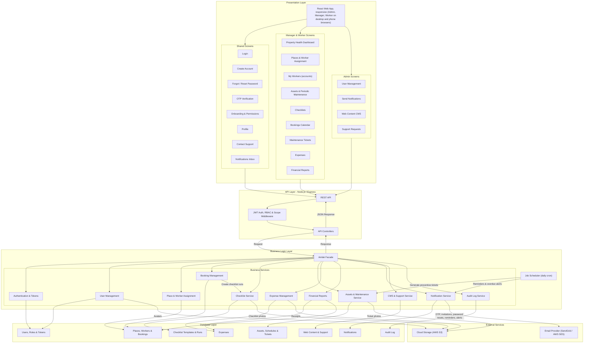
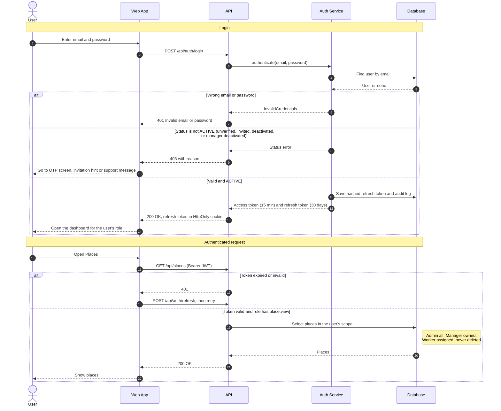
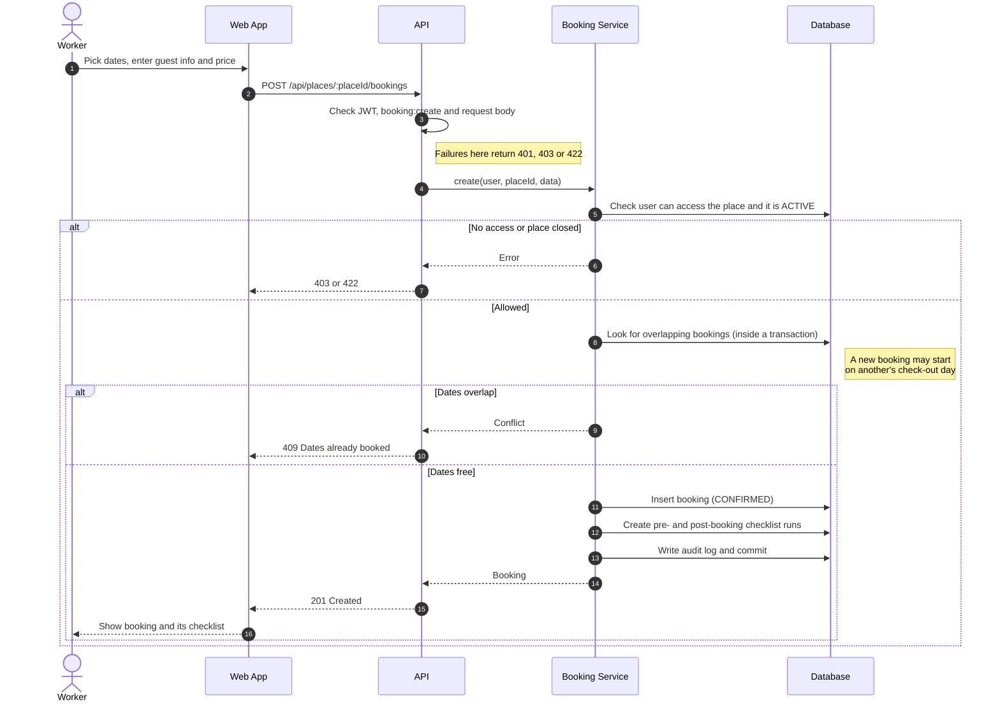
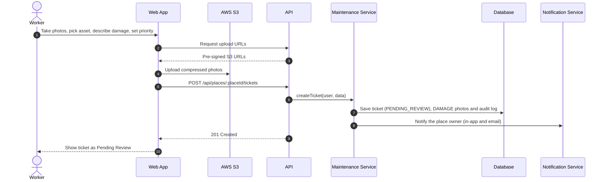
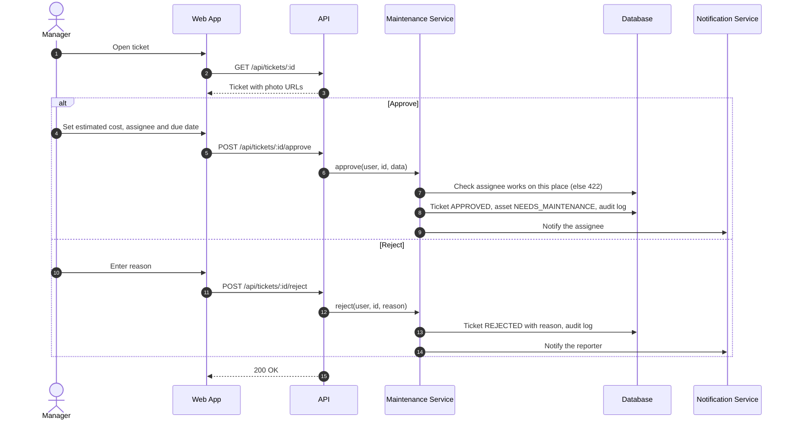
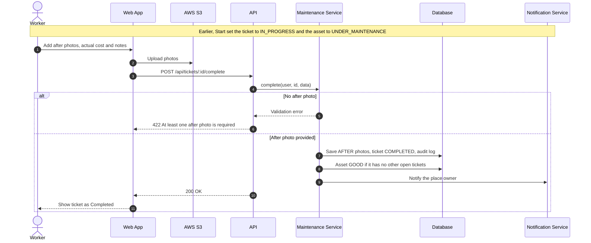

# Amlak — System Requirements Specification

## 1. System Roles Explained

* **Admin:** The highest level of authority. Admins represent the platform owners and have full control over everything in the system: user accounts, web content, support requests and notifications, and also every manager's places, workers, assets, checklists, bookings, tickets, expenses and financial reports.

* **Manager:** The owner/supervisor of properties. Managers handle property and asset CRUD, assign workers to their properties, build checklists, review maintenance tickets, schedule periodic maintenance, log expenses and generate financial reports.

* **Worker:** On-site operational staff, always assigned to one or more properties by a Manager. Workers run checklists, manage bookings, report damaged assets and submit photo proof. A Worker can only see data for places they are assigned to, and never sees financial data.

* **User:** A newly registered or unassigned account. Has access to account settings, onboarding and profile only, until an Admin changes their role.

---

## 2. Prioritized User Stories

Prioritized with **MoSCoW**: **Must Have** (in this release, fully modeled below) · **Should Have** (important, next release) · **Could Have** (nice extras, later) · **Won't Have** (explicitly out of scope for now). In the Role column, "User" means any logged-in account holder.
 
| Category | Role | User Story | Priority |
| :--- | :--- | :--- | :--- |
| **Authentication** | Manager | As a property manager, I want to register an account using my full name, email, and password so that I can securely save my data. *(Registration always creates a Manager account.)* | Must Have |
| **Authentication** | User | As a user, I want to log in using my credentials so that I can securely access my account and resume my activities. | Must Have |
| **Authentication** | User | As a user, I want to receive a one-time code by email when I register so that my identity is verified. | Must Have |
| **Authentication** | User | As a user, I want to manage my basic information (e.g., profile picture, name) so that my account profile remains accurate and complete. | Must Have |
| **Authentication** | User | As a user, I want to request a new verification code so that I can complete registration if the initial code is delayed or lost. | Must Have |
| **Authentication** | User | As a user, I want to reset my password through a link sent to my email so that I can get back into my account if I forget it. | Must Have |
| **Authentication** | User | As a user, I want to sign up via Single Sign-On (Google/Apple) so that I can access the system quickly without creating a new password. | Could Have |
| **Authentication** | User | As a user, I want to select my interests during onboarding so that the system can personalize my content. | Could Have |
| **Onboarding** | Manager/Worker | As a manager/worker, I want clear explanations for device permission requests (Location/Camera) so that I understand why the app needs them. | Must Have |
| **Onboarding** | User | As a user, I want the option to skip the onboarding tutorial so that I can access the application immediately. | Could Have |
| **Onboarding** | User | As a user, I want a brief introductory walkthrough so that I can quickly understand the application's core features and value. | Could Have |
| **Onboarding** | Manager/Worker | As a manager/worker, I want contextual tooltips during my first login so that I can easily navigate and discover key features. | Could Have |
| **Property & Asset** | Manager | As a manager, I want to add, edit, and delete properties so that I can accurately track their maintenance and financial data. | Must Have |
| **Property & Asset** | Manager | As a manager, I want to add, edit and remove assets in my properties so that I can track their condition and maintenance. | Must Have |
| **Property & Asset** | Manager | As a manager, I want to create, edit and deactivate worker accounts so that my staff can access the app without registering themselves. | Must Have |
| **Property & Asset** | Manager | As a manager, I want to assign and unassign workers to my properties so that each worker only sees and operates on the places they are responsible for. | Must Have |
| **Property & Asset** | Worker | As a worker, I want to report damaged assets or required maintenance so that the property remains in optimal condition. | Must Have |
| **Property & Asset** | Manager | As a manager, I want a unified dashboard showing property and asset health so that I can monitor the status of all locations at a glance. | Must Have |
| **Maintenance** | Manager | As a manager, I want to create customized pre- and post-booking checklists so that workers can ensure quality standards are met. | Must Have |
| **Maintenance** | Manager | As a manager, I want to receive and review maintenance tickets so that I can approve or reject them based on priority and budget. | Must Have |
| **Maintenance** | Worker | As a worker, I want to submit maintenance reports with photo attachments so that I can provide visual proof of completed work or damages. | Must Have |
| **Maintenance** | Manager | As a manager, I want to schedule periodic asset maintenance so that properties remain safe, functional, and in good condition. | Must Have |
| **Maintenance** | Worker | As a worker, I want to receive email reminders for upcoming maintenance tasks so that I do not miss any scheduled work. | Must Have |
| **Maintenance** | Manager | As a manager, I want to receive automated email alerts for overdue or incomplete maintenance tasks so that I can address operational delays promptly. | Must Have |
| **Booking** | Worker | As a worker, I want to manage (add/cancel) bookings on a calendar, including guest info and pricing, so that I can maintain an accurate reservation schedule. | Must Have |
| **Booking** | Worker | As a worker, I want to check guests in and out, and be stopped from checking a guest in before the place's checklists are done, so that every guest arrives to a checked and prepared place. | Must Have |
| **Financial** | Manager | As a manager, I want to log all property expenses (maintenance, bills, taxes) so that I can maintain accurate financial records. | Must Have |
| **Financial** | Manager | As a manager, I want to generate financial reports so that I can effectively track profit, loss, and overall financial health. | Must Have |
| **Financial** | Admin | As an Admin I want to manage plans and payments so I can edit account limits and refund users. | Should Have |
| **Content Management** | Admin | As an Admin I want to create, edit and delete web content so that information stays up to date. | Must Have |
| **User Management** | Admin | As an Admin I want to view, edit and deactivate user accounts so that I can control their access. | Must Have |
| **Support** | Admin | As an Admin I want to view user support requests so that I can resolve problems. | Must Have |
| **Notification** | Admin | As an Admin I want to send notifications to users so I can communicate updates. | Must Have |
| **Reporting & Analytics** | Admin | As an Admin I want to view statistics and filter data so I can export information. | Should Have |
| **Notification** | Manager | As a manager, I want to receive alerts by SMS so that I see urgent issues without opening email. *(Email and in-app only in this release.)* | Won't Have |
| **Booking** | Guest | As a guest, I want to book and pay for a place online so that I don't need to contact the manager. *(Bookings are entered by staff.)* | Won't Have |
| **Booking** | Manager | As a manager, I want bookings synced automatically from external booking platforms so that I don't enter them twice. | Won't Have |
| **Localization** | User | As a user, I want the app in languages other than Arabic and English so that I can use my own language. | Won't Have |

---

## 3. Non-Functional Requirements (NFRs)

### Security & Authentication

* **JWT with refresh tokens:** Access tokens are short-lived (15 minutes) and carry `user_id` and `role`. Refresh tokens are long-lived (30 days), stored **hashed** in `REFRESH_TOKEN`, rotated on every use and revoked on logout or account deactivation. Web clients keep the refresh token in an `HttpOnly`, `Secure`, `SameSite=Strict` cookie. Mobile clients keep it in secure storage (Keychain / Keystore).

* **RBAC:** Every route is protected by role-based middleware, and every query that touches place data is additionally scoped by ownership (Manager) or assignment (Worker). A Worker must never be able to access expenses or financial reports.

* **Password storage:** Passwords are **hashed** with argon2id (or bcrypt, cost ≥ 12) and never encrypted or stored in plain text.

* **OTP security:** OTPs are 6 digits, stored hashed, valid for 10 minutes and single-use. Resend is limited to 1 per 60 seconds and 5 per hour per user. Failed attempts are limited to 5 per code.

* **Data encryption:** Database storage, backups and S3 buckets are encrypted at rest (storage-level encryption, e.g. AWS RDS/S3 encryption). Financial values stay queryable for reporting. All data in transit uses HTTPS/TLS 1.2+.

* **Deactivated accounts:** Deactivating a user immediately revokes all their refresh tokens. Deactivating a Manager also revokes all their workers' refresh tokens, and login and token refresh reject any worker whose Manager is deactivated.

### Performance & Scalability

* **Response time:** API endpoints, especially dashboard metrics and booking calendars, respond within 500 ms under normal load. Dashboard aggregates use indexed queries on `place_id`, `status` and date columns.

* **Media optimization:** Uploaded images (ticket attachments, checklist photos, profile pictures, receipts) are compressed and resized before being stored in cloud storage (AWS S3). Clients upload directly to S3 using pre-signed URLs.

### Usability & Accessibility

* **Arabic and English:** full right-to-left support for Arabic in the web app, emails and notifications.
* **Single web app:** one responsive React web app for every role; there is no separate mobile app. Workers use it in their phone's browser. Camera access uses the browser file input with the camera (`capture`), and location uses the browser Geolocation API; both require HTTPS.
* **Phone-first worker screens:** checklists, damage reports, check-in and photo capture are designed for one-handed use on a phone screen (minimum width 360 px), with large touch targets.
* **Supported browsers:** the latest two versions of Chrome, Safari (including iPhone), Edge and Firefox, on desktop and phone, using the shared design system from the Figma guide.
* **Permission explanations:** the camera is used for ticket, checklist and receipt photos; location is used only to fill a place's map pin from the user's current position when adding or editing a place (workers are not tracked). The browser's camera and location permissions are requested only when first needed, preceded by an in-app screen explaining why; if the user blocks them, the app shows how to re-enable them in the browser settings.

### Reliability & Integrations

* **Email gateway:** The system integrates with a transactional email provider (SendGrid or AWS SES) for OTPs, worker invitations, maintenance reminders and overdue alerts. Failed sends are retried up to 3 times with backoff. SMS is out of scope for this version.
* **In-app notifications:** Every reminder, alert and admin announcement is also stored in `NOTIFICATION` so users can see it in the app.
* **Job scheduler:** A scheduled job runner (e.g. node-cron or BullMQ repeatable jobs). Jobs are idempotent: the `reminder_sent_at` and `overdue_alert_sent_at` fields prevent duplicate emails.
* **Audit logging:** Critical actions are written to `AUDIT_LOG` with timestamp, user ID, action, entity type, entity ID, and before/after values. At minimum: approving, rejecting, reassigning and completing tickets; creating, updating and deleting expenses; deleting or restoring a place; removing an asset; cancelling a booking; checking guests in and out; creating, assigning, unassigning, moving and deactivating workers; changing a user's role; and deactivating or reactivating any account. Audit records are append-only.

---

## 4. Figma Design Guide

https://www.figma.com/design/E2nABXzciiIHZAPG5mNXVM/Abdulwahab-Almatrudi-s-team-library?node-id=3342-3806&t=WxAnupDwu3UPe9A0-1

---

## 5. High-Level Architecture Diagram

---

## 6. classes

### 6.1 Back-end classes
 
| Class | Responsibility | Key methods |
| :--- | :--- | :--- |
| `BaseClass` | Shared `id`, `created_at`, `updated_at` for every entity | — |
| `User` | Any account (Admin, Manager, Worker): login, profile, language; a Manager employs workers | `register`, `login`, `logout`, `verifyEmail`, `requestPasswordReset`, `resetPassword`, `createWorkerAccount`, `completeAccountSetup`, `hasPermission`, `changeStatus` |
| `Role`, `Permission` | Role-based access: Admin, Manager, Worker and their permissions | `addPermission`, `removePermission` |
| `VerificationToken` | Hashed one-time codes and links: email OTP, password reset, worker invitation | `generate`, `verify` |
| `RefreshToken` | Long-lived login sessions, rotated on use, revoked on logout or deactivation | `issue`, `rotate`, `revoke` |
| `Place` | A rental property with map location (can be filled from the browser's current location), currency, time zone and maintenance budget; soft-deleted | `add`, `update`, `softDelete`, `restore`, `assignWorker`, `getHealthSummary`, `getMaintenanceBudgetStatus` |
| `PlaceWorker` | Which workers are assigned to which place | — |
| `Asset` | Equipment in a place (AC, pool pump…) and its health; soft-deleted | `add`, `update`, `softDelete`, `changeStatus` |
| `PeriodicMaintenance` | Recurring maintenance schedule for an asset | `schedule`, `triggerTicket`, `advanceNextDueDate` |
| `MaintenanceTicket` | A repair or preventive job from report to completion | `submit`, `approve`, `reject`, `reassign`, `start`, `complete`, `isOverdue` |
| `TicketAttachment` | Damage, before and after photos of a ticket | `upload`, `delete` |
| `ChecklistTemplate`, `ChecklistTemplateItem` | The manager's reusable pre-/post-booking checklist and its tasks | `create`, `update`, `deactivate` |
| `ChecklistRun`, `ChecklistRunItem` | One completed copy of a checklist for one booking, with ticks, notes and photos | `start`, `complete`, `cancel`, `check` |
| `Booking` | A guest stay: dates, guest, price, check-in and check-out. `isReadyForCheckIn()` is true when its own `PRE_BOOKING` run is completed and the previous booking on the place is checked out with its `POST_BOOKING` run completed | `add`, `cancel`, `hasOverlap`, `isReadyForCheckIn`, `checkIn`, `checkOut` |
| `Expense` | A cost for a place (maintenance, utilities, taxes…), optionally linked to a ticket. Financial reports count **only** expenses; a ticket's `actual_cost` is informational until the Manager logs it as an expense | `add`, `update`, `delete` |
| `FinancialReport` | Computed (not stored) income, expenses and profit for a period | `generate`, `calculateIncome`, `calculateExpenses`, `calculateProfit` |
| `Notification` | In-app message (and email) to a user, stored in the recipient's `preferred_language` (an Admin writes announcements in both languages; the service saves the matching version for each recipient) | `send`, `sendBulk`, `sendToRole`, `markAsRead` |
| `SupportTicket` | A user's support request and the Admin's response | `submit`, `assign`, `resolve`, `reopen` |
| `WebContent` | Public website page, per language | `create`, `update`, `delete`, `publish` |
| `AuditLog` | Append-only record of critical actions | `record` |

### 6.2 classDiagram

```mermaid
classDiagram

    class BaseClass {
        +string id
        +datetime created_at
        +datetime updated_at
    }

    class User {
        +string role_id
        +string email
        +string password_hash
        +string phone
        +string fullname
        +string picture_path
        +string status
        +datetime email_verified_at
        +string preferred_language
        +string manager_id
        +List~User~ workers
        +List~VerificationToken~ verification_tokens
        +List~RefreshToken~ refresh_tokens
        +List~Place~ owned_places
        +List~PlaceWorker~ assignments
        +List~MaintenanceTicket~ reported_tickets
        +List~MaintenanceTicket~ assigned_tickets
        +List~TicketAttachment~ uploaded_attachments
        +List~Booking~ created_bookings
        +List~Expense~ logged_expenses
        +List~Notification~ notifications
        +List~SupportTicket~ support_tickets
        +List~SupportTicket~ handled_support_tickets
        +List~WebContent~ authored_contents
        +List~AuditLog~ audit_logs
        +register()
        +login()
        +logout()
        +updateProfile()
        +resetPassword()
        +requestVerificationCode()
        +requestPasswordReset(string email)
        +verifyEmail()
        +createWorkerAccount()
        +resendInvitation()
        +completeAccountSetup(string password)
        +hasPermission(string permission_name)
        +changeStatus()
    }

    class Role {
        +string name
        +string description
        +List~Permission~ permissions
        +List~User~ users
        +addPermission()
        +removePermission()
    }

    class Permission {
        +string name
        +string description
    }

    class VerificationToken {
        +string user_id
        +string token_hash
        +string token_type
        +datetime expires_at
        +int attempts
        +boolean is_used
        +generate()
        +verify()
    }

    class RefreshToken {
        +string user_id
        +string token_hash
        +string device_info
        +datetime expires_at
        +datetime revoked_at
        +issue()
        +rotate()
        +revoke()
    }

    class Place {
        +string owner_id
        +string place_name
        +string place_type
        +string description
        +string address
        +string city
        +decimal latitude
        +decimal longitude
        +string status
        +decimal monthly_maintenance_budget
        +string currency
        +string timezone
        +datetime deleted_at
        +List~Asset~ assets
        +List~PlaceWorker~ workers
        +List~Booking~ bookings
        +List~Expense~ expenses
        +List~MaintenanceTicket~ maintenance_tickets
        +add()
        +update()
        +softDelete()
        +restore()
        +view()
        +assignWorker(string worker_id)
        +unassignWorker(string worker_id)
        +getHealthSummary()
        +getMaintenanceBudgetStatus()
    }

    class PlaceWorker {
        +string place_id
        +string worker_id
        +string assigned_by
        +boolean is_active
        +datetime assigned_at
    }

    class Asset {
        +string place_id
        +string name
        +string type
        +date purchase_date
        +string status
        +datetime deleted_at
        +List~PeriodicMaintenance~ maintenance_schedules
        +List~MaintenanceTicket~ repair_history
        +add()
        +update()
        +softDelete()
        +changeStatus()
    }

    class PeriodicMaintenance {
        +string asset_id
        +string description
        +string frequency
        +date next_due_date
        +int lead_days
        +string default_assignee_id
        +boolean is_active
        +List~MaintenanceTicket~ generated_tickets
        +schedule()
        +triggerTicket()
        +advanceNextDueDate()
    }

    class MaintenanceTicket {
        +string place_id
        +string asset_id
        +string periodic_maintenance_id
        +string ticket_type
        +string priority
        +string reporter_id
        +string assignee_id
        +string description
        +decimal estimated_cost
        +decimal actual_cost
        +string status
        +date due_date
        +string reviewed_by
        +datetime reviewed_at
        +string rejection_reason
        +datetime started_at
        +datetime completed_at
        +string completion_notes
        +datetime reminder_sent_at
        +datetime overdue_alert_sent_at
        +List~TicketAttachment~ attachments
        +List~Expense~ expenses
        +submit()
        +approve()
        +reject(string reason)
        +reassign(string worker_id, date due_date)
        +start()
        +complete()
        +isOverdue() boolean
    }

    class TicketAttachment {
        +string ticket_id
        +string uploaded_by
        +string file_url
        +string attachment_type
        +upload()
        +delete()
    }

    class Booking {
        +string place_id
        +string created_by
        +string guest_name
        +string guest_phone
        +string guest_email
        +int guest_count
        +date check_in_date
        +date check_out_date
        +decimal total_price
        +string status
        +string notes
        +datetime cancelled_at
        +string cancelled_by
        +string cancellation_reason
        +datetime checked_in_at
        +string checked_in_by
        +datetime checked_out_at
        +string checked_out_by
        +datetime readiness_alert_sent_at
        +add()
        +cancel(string reason)
        +view()
        +hasOverlap() boolean
        +isReadyForCheckIn() boolean
        +checkIn()
        +checkOut()
    }

    class Expense {
        +string place_id
        +string ticket_id
        +string created_by
        +string category
        +string description
        +decimal amount
        +date expense_date
        +string receipt_url
        +add()
        +update()
        +delete()
        +view()
    }

    class FinancialReport {
        +string place_id
        +date period_start
        +date period_end
        +decimal total_income
        +decimal total_expenses
        +decimal profit
        +Map expenses_by_category
        +generate()
        +calculateIncome()
        +calculateExpenses()
        +calculateProfit()
    }

    class Notification {
        +string user_id
        +string sender_id
        +string type
        +string title
        +string message
        +boolean is_read
        +send()
        +sendBulk(List~string~ user_ids)
        +sendToRole(string role_id)
        +markAsRead()
    }

    class SupportTicket {
        +string user_id
        +string assigned_admin_id
        +string subject
        +string description
        +string status
        +string admin_response
        +datetime resolved_at
        +submit()
        +assign(string admin_id)
        +resolve(string response)
        +reopen()
    }

    class WebContent {
        +string author_id
        +string title
        +string language
        +string slug
        +string body
        +boolean is_published
        +create()
        +update()
        +delete()
        +publish()
    }

    class AuditLog {
        +string user_id
        +string action
        +string entity_type
        +string entity_id
        +json old_values
        +json new_values
        +string ip_address
        +record()
    }

    %% Inheritance from BaseClass
    BaseClass <|-- User
    BaseClass <|-- Role
    BaseClass <|-- Permission
    BaseClass <|-- VerificationToken
    BaseClass <|-- RefreshToken
    BaseClass <|-- Place
    BaseClass <|-- PlaceWorker
    BaseClass <|-- Asset
    BaseClass <|-- PeriodicMaintenance
    BaseClass <|-- MaintenanceTicket
    BaseClass <|-- TicketAttachment
    BaseClass <|-- Booking
    BaseClass <|-- Expense
    BaseClass <|-- Notification
    BaseClass <|-- SupportTicket
    BaseClass <|-- WebContent
    BaseClass <|-- AuditLog

    %% RBAC
    Role "1" --> "*" User : assigned to
    Role "*" --> "*" Permission : grants

    %% User relationships
    User "1" --> "*" User : employs (manager → workers)
    User "1" --> "*" VerificationToken : requests
    User "1" --> "*" RefreshToken : holds
    User "1" --> "*" Place : owns
    User "1" --> "*" PlaceWorker : assigned via
    User "1" --> "*" MaintenanceTicket : reports / handles
    User "1" --> "*" TicketAttachment : uploads
    User "1" --> "*" Booking : creates
    User "1" --> "*" Expense : logs
    User "1" --> "*" Notification : receives
    User "1" --> "*" SupportTicket : submits
    User "1" --> "*" SupportTicket : handles (admin)
    User "1" --> "*" WebContent : authors
    User "1" --> "*" AuditLog : performs

    %% Place relationships
    Place "1" --> "*" PlaceWorker : staffed by
    Place "1" --> "*" Asset : contains
    Place "1" --> "*" Booking : has
    Place "1" --> "*" Expense : has
    Place "1" --> "*" MaintenanceTicket : needs

    %% Maintenance
    Asset "1" --> "*" PeriodicMaintenance : scheduled for
    Asset "1" --> "*" MaintenanceTicket : needs
    PeriodicMaintenance "1" --> "*" MaintenanceTicket : generates
    MaintenanceTicket "1" --> "*" TicketAttachment : has
    MaintenanceTicket "1" --> "*" Expense : paid by

    %% Functional dependencies
    FinancialReport ..> Booking : uses
    FinancialReport ..> Expense : uses
```

---

## 7. ER Diagram

```mermaid
erDiagram

    ROLE {
        string id PK
        string name "ADMIN|MANAGER|WORKER"
        string description
        datetime created_at
        datetime updated_at
    }

    PERMISSION {
        string id PK
        string name "e.g. ticket:approve"
        string description
        datetime created_at
        datetime updated_at
    }

    ROLE_PERMISSION {
        string role_id PK, FK
        string permission_id PK, FK
    }

    USER {
        string id PK
        string role_id FK
        string email UK
        string password_hash
        string phone
        string fullname
        string picture_path
        string status "INVITED|PENDING_VERIFICATION|ACTIVE|DEACTIVATED"
        datetime email_verified_at
        string preferred_language "ar|en"
        string manager_id FK "workers only: the manager they work for"
        datetime created_at
        datetime updated_at
    }

    VERIFICATION_TOKEN {
        string id PK
        string user_id FK
        string token_hash
        string token_type "EMAIL_OTP|PASSWORD_RESET|ACCOUNT_SETUP"
        datetime expires_at
        int attempts
        boolean is_used
        datetime created_at
        datetime updated_at
    }

    REFRESH_TOKEN {
        string id PK
        string user_id FK
        string token_hash UK
        string device_info
        datetime expires_at
        datetime revoked_at
        datetime created_at
        datetime updated_at
    }

    PLACE {
        string id PK
        string owner_id FK
        string place_name
        string place_type
        string description
        string address
        string city
        decimal latitude
        decimal longitude
        string status "ACTIVE|INACTIVE|UNDER_MAINTENANCE"
        decimal monthly_maintenance_budget "nullable"
        string currency "default SAR"
        string timezone "default Asia/Riyadh"
        datetime deleted_at "nullable, set = soft deleted"
        datetime created_at
        datetime updated_at
    }

    PLACE_WORKER {
        string id PK
        string place_id FK "unique with worker_id"
        string worker_id FK
        string assigned_by FK
        boolean is_active
        datetime assigned_at
        datetime created_at
        datetime updated_at
    }

    ASSET {
        string id PK
        string place_id FK
        string name
        string type
        string status "GOOD|NEEDS_MAINTENANCE|UNDER_MAINTENANCE|OUT_OF_SERVICE"
        date purchase_date
        datetime deleted_at "nullable, set = removed"
        datetime created_at
        datetime updated_at
    }

    PERIODIC_MAINTENANCE {
        string id PK
        string asset_id FK
        string default_assignee_id FK "nullable"
        string description
        string frequency "MONTHLY|QUARTERLY|YEARLY"
        date next_due_date
        int lead_days
        boolean is_active
        datetime created_at
        datetime updated_at
    }

    MAINTENANCE_TICKET {
        string id PK
        string place_id FK
        string asset_id FK "nullable"
        string periodic_maintenance_id FK "nullable"
        string reporter_id FK "nullable for scheduler"
        string assignee_id FK "nullable until approved"
        string reviewed_by FK "nullable until reviewed"
        string ticket_type "CORRECTIVE|PREVENTIVE"
        string priority "LOW|MEDIUM|HIGH|URGENT"
        string description
        decimal estimated_cost "nullable until approved"
        decimal actual_cost "nullable until completed"
        string status "PENDING_REVIEW|APPROVED|REJECTED|IN_PROGRESS|COMPLETED"
        date due_date
        datetime reviewed_at
        string rejection_reason
        datetime started_at
        datetime completed_at
        string completion_notes
        datetime reminder_sent_at
        datetime overdue_alert_sent_at
        datetime created_at
        datetime updated_at
    }

    TICKET_ATTACHMENT {
        string id PK
        string ticket_id FK
        string uploaded_by FK
        string file_url
        string attachment_type "DAMAGE|BEFORE|AFTER"
        datetime created_at
        datetime updated_at
    }

    BOOKING {
        string id PK
        string place_id FK
        string created_by FK
        string guest_name
        string guest_phone
        string guest_email
        int guest_count
        date check_in_date
        date check_out_date
        decimal total_price
        string status "CONFIRMED|CHECKED_IN|CHECKED_OUT|CANCELLED"
        string notes
        datetime cancelled_at
        string cancelled_by FK "nullable"
        string cancellation_reason
        datetime checked_in_at
        string checked_in_by FK "nullable"
        datetime checked_out_at
        string checked_out_by FK "nullable"
        datetime readiness_alert_sent_at
        datetime created_at
        datetime updated_at
    }

    EXPENSE {
        string id PK
        string place_id FK
        string ticket_id FK "nullable"
        string created_by FK
        string category "MAINTENANCE|UTILITIES|TAXES|CLEANING|SUPPLIES|OTHER"
        string description
        decimal amount
        date expense_date
        string receipt_url
        datetime created_at
        datetime updated_at
    }

    NOTIFICATION {
        string id PK
        string user_id FK
        string sender_id FK "nullable for system"
        string type
        string title
        string message
        boolean is_read
        datetime created_at
        datetime updated_at
    }

    SUPPORT_TICKET {
        string id PK
        string user_id FK
        string assigned_admin_id FK "nullable"
        string subject
        string description
        string status "OPEN|IN_PROGRESS|RESOLVED"
        string admin_response
        datetime resolved_at
        datetime created_at
        datetime updated_at
    }

    WEB_CONTENT {
        string id PK
        string author_id FK
        string title
        string language "ar|en"
        string slug "unique with language"
        string body
        boolean is_published
        datetime created_at
        datetime updated_at
    }

    AUDIT_LOG {
        string id PK
        string user_id FK
        string action
        string entity_type
        string entity_id
        json old_values
        json new_values
        string ip_address
        datetime created_at
    }


    %% RBAC
    ROLE ||--o{ USER : "assigns"
    ROLE ||--o{ ROLE_PERMISSION : "has"
    PERMISSION ||--o{ ROLE_PERMISSION : "included in"


    %% USER
    USER |o--o{ USER : "employs"
    USER ||--o{ VERIFICATION_TOKEN : "requests"
    USER ||--o{ REFRESH_TOKEN : "holds"
    USER ||--o{ PLACE : "owns"
    USER ||--o{ PLACE_WORKER : "is assigned"
    USER |o--o{ MAINTENANCE_TICKET : "reports / handles"
    USER ||--o{ TICKET_ATTACHMENT : "uploads"
    USER ||--o{ BOOKING : "creates"
    USER ||--o{ EXPENSE : "logs"
    USER ||--o{ NOTIFICATION : "receives"
    USER ||--o{ SUPPORT_TICKET : "submits"
    USER |o--o{ SUPPORT_TICKET : "handles (admin)"
    USER ||--o{ WEB_CONTENT : "authors"
    USER ||--o{ AUDIT_LOG : "performs"


    %% PLACE
    PLACE ||--o{ PLACE_WORKER : "staffed by"
    PLACE ||--o{ ASSET : "contains"
    PLACE ||--o{ BOOKING : "has"
    PLACE ||--o{ EXPENSE : "has"
    PLACE ||--o{ MAINTENANCE_TICKET : "needs"


    %% ASSET & MAINTENANCE
    ASSET ||--o{ PERIODIC_MAINTENANCE : "scheduled for"
    ASSET |o--o{ MAINTENANCE_TICKET : "involves"
    PERIODIC_MAINTENANCE |o--o{ MAINTENANCE_TICKET : "generates"
    MAINTENANCE_TICKET ||--o{ TICKET_ATTACHMENT : "has"
    MAINTENANCE_TICKET |o--o{ EXPENSE : "paid by"
```

---

## 8. High-Level Sequence Diagrams

In these diagrams, **API** means the REST API, the JWT/RBAC/scope middleware, the controllers and the Amlak Facade together. Every authenticated request passes the checks described in 8.1.

### 8.1 User Login and Authenticated Request

### 8.2 Worker Creates a Booking

### 8.3 Maintenance Ticket Lifecycle

#### 8.3.1 Worker reports damage

#### 8.3.2 Manager reviews the ticket

#### 8.3.3 Worker completes the work

---

## 9. SCM and QA Strategy

### 9.1. SCM Processes

#### 9.1.1 Version control
- **Tool:** Git, hosted on **GitHub**. GitHub also gives us pull requests, branch protection, CI/CD (GitHub Actions) and issue tracking in one place.
- **Repository:** one monorepo with `apps/api` (Node.js/Express), `apps/web` (React) and `packages/shared` (shared types, enums and validation), so a change to a field is one pull request, not several.

#### 9.1.2 Branching strategy (Simplified GitFlow)

| Branch | Purpose | Created from | Merges into | Deploys to |
| :--- | :--- | :--- | :--- | :--- |
| `main` | Production code, always releasable; every merge is tagged `vX.Y.Z` | — | — | Production (after manual approval) |
| `develop` | Integration branch; all finished work lands here first | `main` | `main` | Staging (automatic) |
| `feature/<ticket>-<name>` | One user story or task (lives 1–3 days) | `develop` | `develop` | — |
| `fix/<ticket>-<name>` | Non-urgent bug found on staging | `develop` | `develop` | — |
| `hotfix/<ticket>-<name>` | Urgent production bug | `main` | `main` and `develop` | Production |

**Why:** `develop` maps to staging and `main` to production. Full GitFlow release branches are not needed because we ship one SaaS version. Trunk-based development needs feature flags and very mature CI.

#### 9.1.3 Regular commits, code reviews and pull requests

**Commits**
- Small commits, one logical change each; feature branches are pushed at least once a day.
- Format: **Conventional Commits** (`type(scope): summary`), e.g. `feat(booking): block check-in until checklists are done`.
- Git hooks (Husky) run lint and format checks before each commit and check the message format (commitlint).
- Secrets are never committed (`.env` is git-ignored).

**Pull requests**
- Every change goes through a pull request; direct pushes to `main` and `develop` are blocked.
- A pull request can merge only when CI is green and it has **1 approval** (`develop`) or **2 approvals** (`main`).
- Pull requests stay small (under ~400 changed lines), link their issue, and are **squash-merged** into `develop`.

**Code review**
- Reviewers respond within one working day.
- They check correctness against the user story, security (permissions and data scoping), tests, database migrations and readability.
- A pull request template checklist confirms tests, permissions, audit logging and migrations.

### 9.2. QA Processes

#### 9.2.1 Testing strategy

- **Unit tests:** test each function and component on its own (e.g. booking overlap, check-in readiness, profit calculation).
- **Integration tests:** test every API endpoint with a real test database, including permissions for each role.
- **End-to-end tests:** test critical user flows in a real browser (e.g. check-in after checklists, ticket approval).
- **Manual testing:** check the main flows on real phones and desktops before each release.

#### 9.2.2 Testing tools

| Tool | Used for |
| :--- | :--- |
| Jest | Unit tests |
| Supertest | API integration tests |
| Playwright | End-to-end tests |
| Postman | API testing and smoke tests |

#### 9.2.3 Deployment pipeline (GitHub Actions)

1. **Pull request:** GitHub Actions runs the unit and integration tests automatically.
2. **Staging:** merging into `develop` deploys to staging automatically, where end-to-end tests run.
3. **Production:** merging `develop` into `main` deploys to production after all tests pass and the team manually approves.
