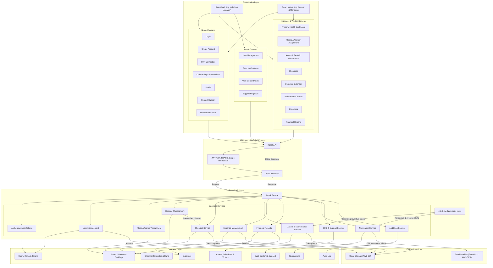

# Amlak — System Requirements Specification

## 1. System Roles Explained

* **Admin:** The highest level of authority. Admins represent the platform owners. They manage user accounts, web content, support requests and platform notifications.

* **Manager:** The owner/supervisor of properties. Managers handle property and asset CRUD, assign workers to their properties, build checklists, review maintenance tickets, schedule periodic maintenance, log expenses and generate financial reports.

* **Worker:** On-site operational staff, always assigned to one or more properties by a Manager. Workers run checklists, manage bookings, report damaged assets and submit photo proof. A Worker can only see data for places they are assigned to, and never sees financial data.

* **User:** A newly registered or unassigned account. Has access to account settings, onboarding and profile only, until an Admin changes their role.

---

## 2. Prioritized User Stories

*Priority Levels: **Must Have** (critical for launch, implemented in this version), **Should Have** (important, future development), **Nice to Have** (enhancement for future iterations).*

| Category | Role | User Story | Priority |
| :--- | :--- | :--- | :--- |
| **Authentication** | User | As a user, I want to register an account using my full name, email, and password so that I can securely save my data. | Must Have |
| **Authentication** | User | As a user, I want to log in using my credentials so that I can securely access my account and resume my activities. | Must Have |
| **Authentication** | Admin | As an admin, I want the system to send an OTP via email so that user identities can be securely verified. | Must Have |
| **Authentication** | User | As a user, I want to manage my basic information (e.g., profile picture, name) so that my account profile remains accurate and complete. | Must Have |
| **Authentication** | User | As a user, I want to request a new verification code so that I can complete registration if the initial code is delayed or lost. | Must Have |
| **Authentication** | User | As a user, I want to sign up via Single Sign-On (Google/Apple) so that I can access the system quickly without creating a new password. | Nice to Have |
| **Authentication** | User | As a user, I want to select my interests during onboarding so that the system can personalize my content. | Nice to Have |
| **Onboarding** | Manager/Worker | As a manager/worker, I want clear explanations for device permission requests (Location/Camera) so that I understand why the app needs them. | Must Have |
| **Onboarding** | User | As a user, I want the option to skip the onboarding tutorial so that I can access the application immediately. | Nice to Have |
| **Onboarding** | User | As a user, I want a brief introductory walkthrough so that I can quickly understand the application's core features and value. | Nice to Have |
| **Onboarding** | Manager/Worker | As a manager/worker, I want contextual tooltips during my first login so that I can easily navigate and discover key features. | Nice to Have |
| **Property & Asset** | Manager | As a manager, I want to add, edit, and delete properties so that I can accurately track their maintenance and financial data. | Must Have |
| **Property & Asset** | Manager | *(new)* As a manager, I want to assign and unassign workers to my properties so that each worker only sees and operates on the places they are responsible for. | Must Have |
| **Property & Asset** | Worker | As a worker, I want to report damaged assets or required maintenance so that the property remains in optimal condition. | Must Have |
| **Property & Asset** | Manager | As a manager, I want a unified dashboard showing property and asset health so that I can monitor the status of all locations at a glance. | Must Have |
| **Maintenance** | Manager | As a manager, I want to create customized pre- and post-booking checklists so that workers can ensure quality standards are met. | Must Have |
| **Maintenance** | Manager | As a manager, I want to receive and review maintenance tickets so that I can approve or reject them based on priority and budget. | Must Have |
| **Maintenance** | Worker | As a worker, I want to submit maintenance reports with photo attachments so that I can provide visual proof of completed work or damages. | Must Have |
| **Maintenance** | Manager | As a manager, I want to schedule periodic asset maintenance so that properties remain safe, functional, and in good condition. | Must Have |
| **Maintenance** | Worker | As a worker, I want to receive email reminders for upcoming maintenance tasks so that I do not miss any scheduled work. | Must Have |
| **Maintenance** | Manager | As a manager, I want to receive automated email alerts for overdue or incomplete maintenance tasks so that I can address operational delays promptly. | Must Have |
| **Booking** | Worker | As a worker, I want to manage (add/cancel) bookings on a calendar, including guest info and pricing, so that I can maintain an accurate reservation schedule. | Must Have |
| **Financial** | Manager | As a manager, I want to log all property expenses (maintenance, bills, taxes) so that I can maintain accurate financial records. | Must Have |
| **Financial** | Manager | As a manager, I want to generate financial reports so that I can effectively track profit, loss, and overall financial health. | Must Have |
| **Financial** | Admin | As an Admin I want to manage plans and payments so I can edit account limits and refund users. | Should Have |
| **Content Management** | Admin | As an Admin I want to create, edit and delete web content so that information stays up to date. | Must Have |
| **User Management** | Admin | As an Admin I want to view, edit and deactivate user accounts so that I can control their access. | Must Have |
| **Support** | Admin | As an Admin I want to view user support requests so that I can resolve problems. | Must Have |
| **Notification** | Admin | As an Admin I want to send notifications to users so I can communicate updates. | Must Have |
| **Reporting & Analytics** | Admin | As an Admin I want to view statistics and filter data so I can export information. | Should Have |

---

## 3. Key Business Rules

### 3.1 Data scoping
* A **Manager** sees only places where `place.owner_id = manager.id`, and everything under them (assets, bookings, tickets, expenses, checklists, assigned workers).
* A **Worker** sees only places listed in `PLACE_WORKER` for that worker (with `is_active = true`), and only operational data under them. Expenses and financial reports are never returned to a Worker.
* An **Admin** sees all users, content and support tickets, but does not edit Manager business data.

### 3.2 Bookings
* A booking covers `check_in_date` to `check_out_date`. Two `CONFIRMED` bookings on the same place cannot overlap.
* Cancelling sets `status = CANCELLED`, `cancelled_at`, `cancelled_by` and `cancellation_reason`. Bookings are never hard-deleted.
* Creating a booking creates a `PRE_BOOKING` checklist run and a `POST_BOOKING` checklist run from the place's active templates.

### 3.3 Checklists
* A **template** belongs to a place and has a type (`PRE_BOOKING` or `POST_BOOKING`) and ordered items. Items can require a photo.
* A **run** is one execution of a template for one booking, by one worker. Run items record whether each item was checked, plus an optional note and photo.
* Editing a template never changes past runs.

### 3.4 Maintenance ticket lifecycle

```
PENDING_REVIEW ──approve──> APPROVED ──start──> IN_PROGRESS ──complete──> COMPLETED
       │
       └──reject──> REJECTED   (rejection_reason required)
```

* `CORRECTIVE` tickets are opened by a Worker (damage report). `PREVENTIVE` tickets are generated by the scheduler from `PERIODIC_MAINTENANCE`.
* Preventive tickets are created already `APPROVED`, with `assignee_id` taken from the schedule's `default_assignee_id`.
* A ticket is **overdue** when `due_date < today` and status is `APPROVED` or `IN_PROGRESS`. Overdue is computed, not stored.
* Completing a ticket requires at least one `AFTER` photo attachment.
* When a ticket is approved, the asset status becomes `NEEDS_MAINTENANCE`. When it is completed, the asset returns to `GOOD` unless the manager sets otherwise.

### 3.5 Scheduler jobs (daily)
| Job | Rule | Recipient |
| :--- | :--- | :--- |
| Generate preventive tickets | For each active schedule with `next_due_date - lead_days <= today`, create a ticket and advance `next_due_date` by the frequency | — |
| Upcoming reminder | Ticket due within 2 days and `reminder_sent_at` is null | Assignee (Worker), email + in-app |
| Overdue alert | Ticket is overdue and `overdue_alert_sent_at` is null | Place owner (Manager), email + in-app |

### 3.6 Financial reports
* **Income** = sum of `total_price` for `CONFIRMED` bookings whose `check_in_date` falls in the period.
* **Expenses** = sum of `amount` for expenses whose `expense_date` falls in the period.
* **Profit** = income − expenses.
* Reports can be filtered by period and by place, and broken down by expense category. They are computed on request, not stored.

### 3.7 Enumerations
| Field | Values |
| :--- | :--- |
| `USER.status` | `PENDING_VERIFICATION`, `ACTIVE`, `DEACTIVATED` |
| `ROLE.name` | `ADMIN`, `MANAGER`, `WORKER`, `USER` |
| `PLACE.status` | `ACTIVE`, `INACTIVE`, `UNDER_MAINTENANCE` |
| `PLACE.place_type` | `APARTMENT`, `VILLA`, `CHALET`, `ROOM`, `OTHER` |
| `ASSET.status` | `GOOD`, `NEEDS_MAINTENANCE`, `UNDER_MAINTENANCE`, `OUT_OF_SERVICE` |
| `BOOKING.status` | `CONFIRMED`, `CANCELLED` |
| `CHECKLIST_TEMPLATE.checklist_type` | `PRE_BOOKING`, `POST_BOOKING` |
| `CHECKLIST_RUN.status` | `PENDING`, `IN_PROGRESS`, `COMPLETED` |
| `MAINTENANCE_TICKET.ticket_type` | `CORRECTIVE`, `PREVENTIVE` |
| `MAINTENANCE_TICKET.priority` | `LOW`, `MEDIUM`, `HIGH`, `URGENT` |
| `MAINTENANCE_TICKET.status` | `PENDING_REVIEW`, `APPROVED`, `REJECTED`, `IN_PROGRESS`, `COMPLETED` |
| `TICKET_ATTACHMENT.attachment_type` | `DAMAGE`, `BEFORE`, `AFTER` |
| `PERIODIC_MAINTENANCE.frequency` | `MONTHLY`, `QUARTERLY`, `YEARLY` |
| `EXPENSE.category` | `MAINTENANCE`, `UTILITIES`, `TAXES`, `CLEANING`, `SUPPLIES`, `OTHER` |
| `VERIFICATION_TOKEN.token_type` | `EMAIL_OTP`, `PASSWORD_RESET` |
| `NOTIFICATION.type` | `ANNOUNCEMENT`, `MAINTENANCE_REMINDER`, `OVERDUE_ALERT`, `TICKET_UPDATE`, `SYSTEM` |
| `SUPPORT_TICKET.status` | `OPEN`, `IN_PROGRESS`, `RESOLVED` |
| `AUDIT_LOG.action` | `CREATE`, `UPDATE`, `DELETE`, `APPROVE`, `REJECT`, `CANCEL`, `DEACTIVATE`, `LOGIN` |

---

## 4. RBAC Permission Matrix

✅ = allowed · 🔸 = only within own/assigned places · ❌ = denied

| Permission | Admin | Manager | Worker | User |
| :--- | :---: | :---: | :---: | :---: |
| `profile:manage_own` | ✅ | ✅ | ✅ | ✅ |
| `place:create / update / delete` | ❌ | 🔸 | ❌ | ❌ |
| `place:view` | ❌ | 🔸 | 🔸 | ❌ |
| `place_worker:assign` | ❌ | 🔸 | ❌ | ❌ |
| `asset:create / update / delete` | ❌ | 🔸 | ❌ | ❌ |
| `asset:view` | ❌ | 🔸 | 🔸 | ❌ |
| `dashboard:view` | ❌ | 🔸 | ❌ | ❌ |
| `checklist_template:manage` | ❌ | 🔸 | ❌ | ❌ |
| `checklist_run:execute` | ❌ | 🔸 | 🔸 | ❌ |
| `booking:create / cancel / view` | ❌ | 🔸 | 🔸 | ❌ |
| `ticket:create` (damage report) | ❌ | 🔸 | 🔸 | ❌ |
| `ticket:approve / reject` | ❌ | 🔸 | ❌ | ❌ |
| `ticket:complete` (with photos) | ❌ | 🔸 | 🔸 (assignee only) | ❌ |
| `periodic_maintenance:manage` | ❌ | 🔸 | ❌ | ❌ |
| `expense:manage` | ❌ | 🔸 | ❌ | ❌ |
| `financial_report:view` | ❌ | 🔸 | ❌ | ❌ |
| `user:view / update / deactivate` | ✅ | ❌ | ❌ | ❌ |
| `web_content:manage` | ✅ | ❌ | ❌ | ❌ |
| `support_ticket:create` | ❌ | ✅ | ✅ | ✅ |
| `support_ticket:view_all / resolve` | ✅ | ❌ | ❌ | ❌ |
| `notification:send` | ✅ | ❌ | ❌ | ❌ |
| `audit_log:view` | ✅ | 🔸 | ❌ | ❌ |

The 🔸 checks are enforced in the service layer (ownership / assignment lookup), not only by role in the middleware.

---

## 5. Non-Functional Requirements (NFRs)

### Security & Authentication

* **JWT with refresh tokens:** Access tokens are short-lived (15 minutes) and carry `user_id` and `role`. Refresh tokens are long-lived (30 days), stored **hashed** in `REFRESH_TOKEN`, rotated on every use and revoked on logout or account deactivation. Web clients keep the refresh token in an `HttpOnly`, `Secure`, `SameSite=Strict` cookie. Mobile clients keep it in secure storage (Keychain / Keystore).

* **RBAC:** Every route is protected by role-based middleware (Section 4), and every query that touches place data is additionally scoped by ownership (Manager) or assignment (Worker). A Worker must never be able to access expenses or financial reports.

* **Password storage:** Passwords are **hashed** with argon2id (or bcrypt, cost ≥ 12) and never encrypted or stored in plain text.

* **OTP security:** OTPs are 6 digits, stored hashed, valid for 10 minutes and single-use. Resend is limited to 1 per 60 seconds and 5 per hour per user. Failed attempts are limited to 5 per code.

* **Data encryption:** Database storage, backups and S3 buckets are encrypted at rest (storage-level encryption, e.g. AWS RDS/S3 encryption). Financial values stay queryable for reporting. All data in transit uses HTTPS/TLS 1.2+.

* **Deactivated accounts:** Deactivating a user immediately revokes all their refresh tokens.

### Performance & Scalability

* **Response time:** API endpoints, especially dashboard metrics and booking calendars, respond within 500 ms under normal load. Dashboard aggregates use indexed queries on `place_id`, `status` and date columns.

* **Media optimization:** Uploaded images (ticket attachments, checklist photos, profile pictures, receipts) are compressed and resized before being stored in cloud storage (AWS S3). Clients upload directly to S3 using pre-signed URLs.

### Usability & Accessibility

* **Client platforms:** React (web) for Admin and Manager. React Native (Expo) for Worker and Manager on mobile, which provides native camera and location access.

* **Mobile-first worker UI:** Checklists, damage reports and photo capture are optimized for one-handed mobile use.

* **Cross-platform consistency:** UI behaves consistently across iOS, Android and web, using the shared design system from the Figma guide.

* **Permission explanations:** Camera and location permissions are requested only when first needed, preceded by an in-app screen explaining why.

### Reliability & Integrations

* **Email gateway:** The system integrates with a transactional email provider (SendGrid or AWS SES) for OTPs, maintenance reminders and overdue alerts. Failed sends are retried up to 3 times with backoff. SMS is out of scope for this version.

* **In-app notifications:** Every reminder, alert and admin announcement is also stored in `NOTIFICATION` so users can see it in the app.

* **Job scheduler:** A scheduled job runner (e.g. node-cron or BullMQ repeatable jobs) runs the daily jobs in Section 3.5. Jobs are idempotent: the `reminder_sent_at` and `overdue_alert_sent_at` fields prevent duplicate emails.

* **Audit logging:** Critical actions are written to `AUDIT_LOG` with timestamp, user ID, action, entity type, entity ID, and before/after values. At minimum: approving or rejecting tickets, completing tickets, creating/updating/deleting expenses, deleting a place, cancelling a booking, assigning or unassigning workers, and deactivating a user. Audit records are append-only.

---

## 6. Figma Design Guide

https://www.figma.com/design/E2nABXzciiIHZAPG5mNXVM/Abdulwahab-Almatrudi-s-team-library?node-id=3342-3806&t=WxAnupDwu3UPe9A0-1

---

## 7. High-Level Architecture Diagram



---

## 8. Class Diagram


---

## 9. ER Diagram


### Recommended indexes
* `PLACE(owner_id)`, `PLACE_WORKER(worker_id, is_active)`, unique `PLACE_WORKER(place_id, worker_id)`
* `BOOKING(place_id, status, check_in_date, check_out_date)` for calendar and overlap checks
* `MAINTENANCE_TICKET(place_id, status)`, `MAINTENANCE_TICKET(assignee_id, status, due_date)` for reminders and overdue alerts
* `PERIODIC_MAINTENANCE(is_active, next_due_date)` for the scheduler
* `EXPENSE(place_id, expense_date)` for reports
* `NOTIFICATION(user_id, is_read)`
* `AUDIT_LOG(entity_type, entity_id)`, `AUDIT_LOG(user_id, created_at)`
